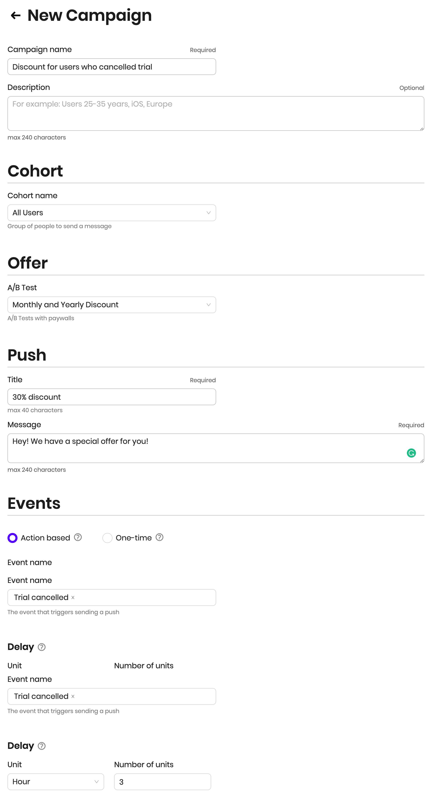

# Getting Started

## What is Adapty?

Adapty helps mobile developers to analyze and grow in-app subscriptions.

## **Why use Adapty?**

Most likely, only up to 5% of your users convert to subscribers. Adapty ****helps you to motivate the rest 95% to subscribe with [A/B tests](purchase-infrastructure/ab-tests.md#set-up-a-b-test) and [Promo campaigns](profiles-and-promo-campaigns/promo-campaigns.md).

### 

### Marketing automation and testing

Engage non-subscribed users with personal offers using promo campaigns.



A/B tests for subscription plans. Test different prices, durations, trial periods for your subscriptions as well as different visual elements.

Analytics for the app economy. Detailed metrics related to your app monetization.



Adapty can send [subscription events](analytics/integrations/#events) to 3rd party analytics: Mixpanel, Amplitude, Facebook Ads, AppMetrica, AppsFlyer, Adjust, Branch, and custom Webhook.



[Mobile SDK for purchases](https://github.com/adaptyteam/AdaptySDK-iOS). Adapty performs server-side receipt validation for you and syncs your customers for both iOS and Android. It also works in Observer mode, so you can use SDK without changing your existing purchase infrastructure.

### 

### Adapty works for developers, marketers, and executives

Marketers can directly engage users with promotional offers to return them to the service or upsell new products. With Adapty there is no need for programmers and analysts to manually extract segments and run promotional campaigns.

For product managers and executives, Adapty has a dashboard with viable subscription metrics with daily/weekly/monthly reports to Slack and Emails.

