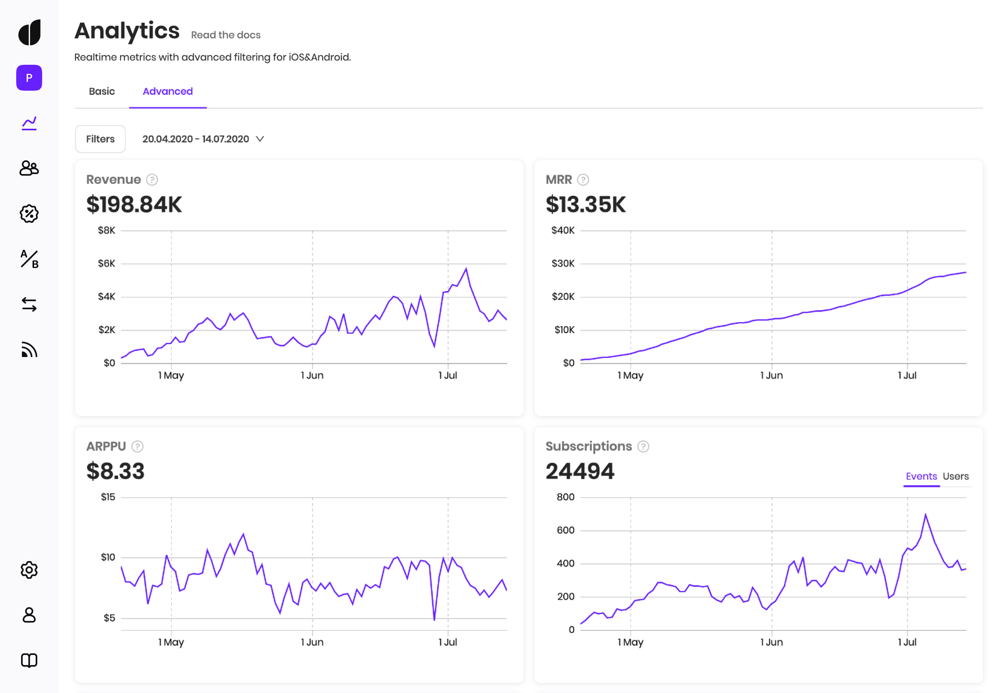

# Advanced Analytics

Install [Adapty SDK](https://github.com/adaptyteam/AdaptySDK-iOS) and start analyzing real-time metrics of your iOS or Android app with advanced filters, such as ad network, ad campaign, country, A/B test, and more.

### Metrics

Advanced Analytics allows you to track the following metrics.

#### Revenue

Total money received from both subscriptions and one-time purchases. Does not include revenue from subscriptions and purchases that were refunded afterward.

#### Monthly Recurring Revenue \(MRR\)

The measure of the predictable and recurring revenue components of your subscription business. Calculated as following:

$$
MRR_i = \sum_{subscriptions}{{P_s*N_s}\over{D_{sm}}}
$$

Where:  
Ps - subscription price  
Ns - number of active paid subscriptions for this subscription  
Dsm - subscription duration in months \(0.25 for weekly subscriptions\)

Basically, MRR shows revenue from all active subscriptions normalized to one month. For example, for a yearly subscription, instead of counting full revenue from the start, revenue is split into 12 equal parts which are evenly spread across 12 month period.

E.g. if there are 2 active yearly subscriptions with price $240 and 10 monthly subscriptions with price $30,  
MMR = 240 \* 2 / 12 + 30 \* 10 / 1 = $340

#### ARPPU

An average revenue per paid user. Calculated as `revenue / number of users who paid`  
If revenue this day is $1000, and there were 50 users who made at least one purchase,  
ARPPU = 1000 / 50 = $20

#### Subscriptions

**Events**  
The number of subscription activations, including renewals.  
**Users**  
The number of currently active subscriptions.  
**Status**  
The number of active subscriptions segmented by [auto-renew status](advanced-analytics.md#sub-trial-auto-renewal-off) which indicates whether or not this subscription will be renewed to the next period.

#### Trials

**Events**  
The number of free trial activations.  
**Users**  
The number of currently active free trials.  
**Status**  
The number of active trials segmented by [auto-renew status](advanced-analytics.md#sub-trial-auto-renewal-off) which indicates whether or not this trial will be converted to a paid subscription.

#### Grace Period

The number of subscriptions that entered the Grace Period due to the billing issue. During the Grace Period subscription is still active while the store tries to receive payment. After Grace Period ends without successful renewal, the subscription enters [Billing Issue](advanced-analytics.md#billing-issues) state.

#### Billing Issues

**Events**  
The number of subscriptions that entered the Billing Issue state.  
**Users**  
The number of subscriptions that are currently in the Billing Issue state

Subscription usually enters the Billing Issue state if the store is unable to receive payment from the subscriber due to some reason \(e.g. expired credit card or when the user just does not enough money\).  
While the Billing Issue state is taking place, the subscription is not active.  
If the Grace Period feature is enabled \(in the store settings\), that Billings Issue state becomes active only after the [Grace Period](advanced-analytics.md#grace-period) expires.

#### Churned Subscriptions

The number of subscription and trial cancellations segmented by cancellation reasons.  
This metric does not include Auto-Renewal [on](advanced-analytics.md#sub-trial-restored)/[off](advanced-analytics.md#subscription-trial-cancelled) state change cases and shows only the subscriptions that are already ended \(expired\).

#### Refunds

**Events**  
The number of refunded purchases and subscriptions.  
**Money**  
Amount of money that was refunded.

#### **Subscription/Trial Cancelled**

The number of subscriptions/trials that entered Auto-Renewal Off state.  
Auto-Renewal Off state means that the user switched off auto-renewal of subscription/trial, so it won't be automatically renewed to the next period.

#### **Sub/Trial Restored**

The number of subscriptions/trials that went back Auto-Renewal On state.  
Auto-Renewal On state means that subscription/trial will be automatically renewed to the next period. Auto-Renewal On state is the default renewal state of the auto-renewable subscription.

### Filters

Advanced Analytics provides the following filters.

#### Countries

Filter metrics by user's store country \(if available, otherwise IP country is used\).

#### Products

Filter metrics by product \(both subscriptions and one-time purchases are available\).

#### Platforms

Filter metrics by platform \(iOS/Android\).

#### A/B tests

Filter metrics by A/B tests that are associated with purchases.  
In case your A/B tests have multiple [revisions](../purchase-infrastructure/ab-tests.md#versioning-edition) \(versions\), they are marked as "Rev. X" so you can choose the specific one.

#### Attribution

Filter metrics by Attribution fields like Status, Channel, Campaign, etc.

