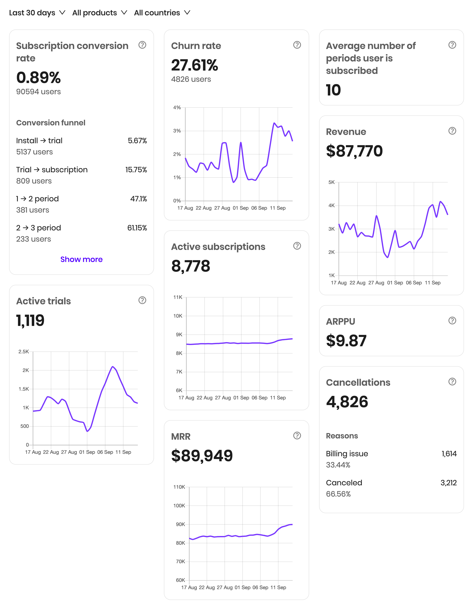

# Basic Analytics

Basic analytics allows you to filter metrics by dates, products, and countries. As of now, it only works for iOS after uploading [App Store Connect credentials](../settings/app-store-connect.md). To get more insights for both iOS and Android, install SDK, and use [Advanced Analytics](advanced-analytics.md).

Since Basic Analytics is calculated based on App Store Connect Sales reports which do not provide reliable user-purchase relation data, Subscription conversion rate metric can show inaccurate results if a short period of time is chosen as a date filter; please consider choosing a longer period \(like a year\), which results in more reliable estimation.

Basic analytics data refreshed daily around 4 pm UTC and shows the data for the previous day. These are restrictions of App Store Connect.

