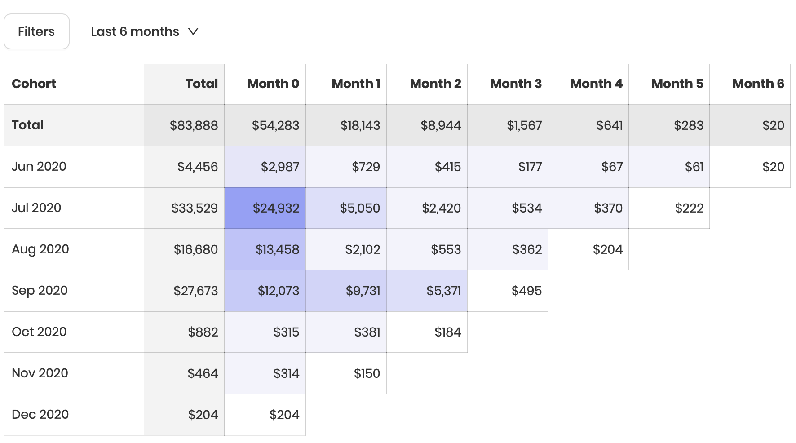

# Cohorts

Install [Adapty SDK](https://github.com/adaptyteam/AdaptySDK-iOS) and get access to Cohorts. This tool lets you analyze your revenue dynamics to:

* Understand your churn and retention patterns
* Track up to the moment revenue for each cohort
* Measure impact from product or pricing changes

Here is what it looks like:

## How is this table calculated?

### Rows

"Cohort" in other words is just "a group of users" and each such group has a row in the table. In the most standard case, the grouping of users into cohorts is time-based. Our Cohorts are based on the time of install.

For example, for a user to end up in a Jul 2020 cohort, their install has to occur any time from July 1st to July 31st. **Note:** in case we don't have an install time for a user \(which is often the case when Adapty is installed after the app has been launched\), we just take the time of their first transaction.

### Columns

Columns show the revenue each cohort has generated over time. Each "month" is a 30-day window, and each "day" is a 24-hour window.

For instance, **Month 0** lasts from the time of install to 30\*24=720 hours from that; **Month 1** from 720 hours after the time of install to 1440 hours and so on.

**Note: "**Months" are calculated for each user indidually. For a user who installed the app on July 1st 3:00 PM, "Month 0" will last until July 31st 3:00PM. If they make a transation at July 31st 3:05PM, it will end up in the Month 1 column.

Simply put, Month 0 for a Jul 2020 cohort isn't exactly "August", it's actually a period from July 31st up to August 30th.

### "Total" column and row

Total column shows the total revenue for each cohort. This value is useful to quickly calculate the ROI for this month \(provided you have the acquistion costs\).

Total row shows the total revenue for each column. This is useful to understand how quickly it accumulates in general as it shows a sort of a general picture for all your cohorts.

### Incomplete data

The last cell in every row is always white as it has incomplete data \(as the 30-day window for the cohort has not yet passed\). Be careful while making decisions based on incomplete data.

## Filters

You can filter the Cohorts by country, product or platform. If you filter by products, only revenue from those products will be taken into account.

