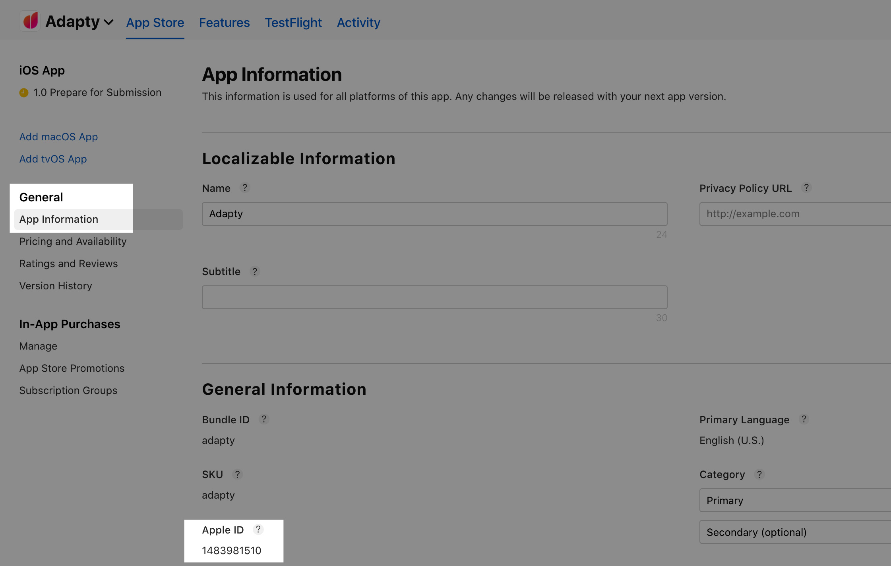
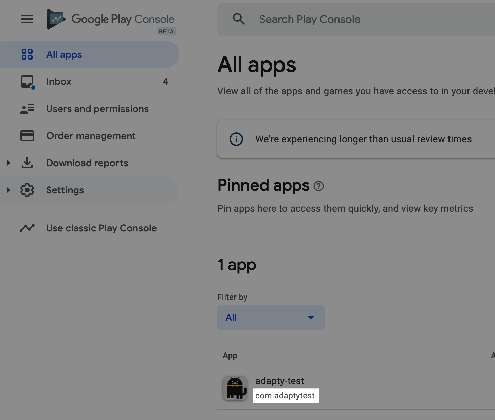
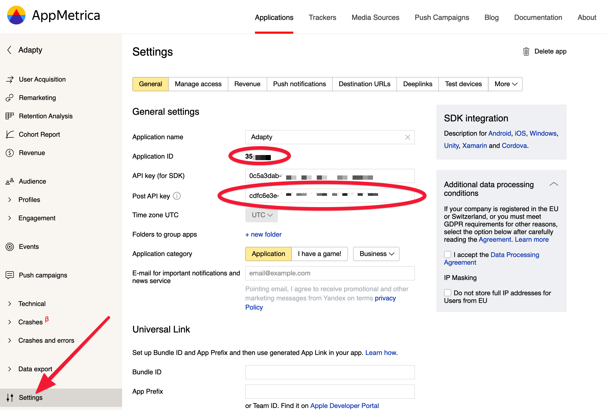

# 3rd party analytics

Apple and Google send subscription events directly to the server using [Subscription Status URL](../../settings/ios-sdk.md#app-store-connect-subscription-status-url) and [Real-time developer notifications \(RTDN\)](../../settings/android-sdk.md#real-time-developer-notifications-rtdn). Therefore, apps can not send events to analytical systems correctly and on-time. For example, if the user subscribed and then didn't open the app, without a server developer will get zero information about subscription status. 


It's not a raw events proxy from Apple/Google. Adapty processes events into human-readable format instantly as they created and enriches them with additional information, such as customer ID, consecutive payments, and others. Besides that Apple doesn't send events about subscription renewals but we do.


You don't need to implement custom server logic to process Apple and Google Play subscription events, Adapty does it for you. Make sure to set up  [Subscription Status URL](../../settings/ios-sdk.md#app-store-connect-subscription-status-url) for iOS and [Real-time developer notifications \(RTDN\)](../../settings/android-sdk.md#real-time-developer-notifications-rtdn) for Android.

Each integration is native, so Adapty maps some properties to system-native.


If you leave the Event Name blank, Adapty won't send it.


### [AppsFlyer](https://app.adapty.io/integrations/appsflyer)

To integrate AppsFlyer go to [Integrations -&gt; AppsFlyer](https://app.adapty.io/integrations/appsflyer) and set credentials.

To find App ID, open your app page in [App Store Connect](https://appstoreconnect.apple.com/), go to the **App Information** page in section **General** and find **Apple ID** in the left bottom part of the screen.



To find Android Package Name, open your app page on [Google Play Console](https://play.google.com/apps/publish). You can see it under the app name.



Open [AppsFlyer](https://hq1.appsflyer.com/auth/login) and navigate to your app page. Scroll the left menu bar, find App Settings, and use **Dev Key.**



AppsFlyer doesn't have a Sandbox mode for server2server integration. So you need a different application/account in AppsFlyer to for Sandbox Dev Key.

**DO NOT USE YOUR MAIN DEV KEY AS A SANDBOX KEY**


Adapty maps some [events](events.md) to AppsFlyer [standard events](https://support.appsflyer.com/hc/en-us/articles/115005544169-Rich-in-app-events-for-Android-and-iOS#event-types) by default. With such configuration, AppsFlyer can [further send events](https://support.appsflyer.com/hc/en-us/articles/208439256-In-App-Events-Postback-Configuration#event-mapping) to each ad network that you use without additional setup.

#### SDK configuration.

It's very important to send AppsFlyer attribution data from the device to Adapty [using](https://github.com/adaptyteam/AdaptySDK-iOS/blob/master/Documentation/AdvancedUsage.md#attribution-tracker-integration) `Adapty.updateAttribution()` SDK method. The example below shows how to do that.



```swift
import AppsFlyerLib

// AppsFlyer v5 (AppsFlyerTrackerDelegate)
extension AppDelegate: AppsFlyerTrackerDelegate {
    func onConversionDataSuccess(_ conversionInfo: [AnyHashable : Any]) {
        // It's important to include the network user ID
        Adapty.updateAttribution(conversionInfo, source: .appsflyer, networkUserId: AppsFlyerTracker.shared().getAppsFlyerUID())
    }
}

// AppsFlyer v6 (AppsFlyerLibDelegate)
extension AppDelegate: AppsFlyerLibDelegate {
    func onConversionDataSuccess(_ installData: [AnyHashable : Any]) {
        // It's important to include the network user ID
        Adapty.updateAttribution(installData, source: .appsflyer, networkUserId: AppsFlyerLib.shared().getAppsFlyerUID())
    }
}
```



### [Mixpanel](https://app.adapty.io/integrations/mixpanel)

To integrate Adapty with Mixpanel you need only one variable: Mixpanel access token. Find the token in your Mixpanel project. If you need help, [here's](https://help.mixpanel.com/hc/en-us/articles/115004502806-Find-Project-Token-) the official docs.


Adapty ****maps some properties such as user id and revenue of the event to [Mixpanel-native properties](https://help.mixpanel.com/hc/en-us/articles/115004708186-Profile-Properties). With such mapping, Mixpanel is able to show you correct data in the profile and events timeline.

Adapty also accumulates revenue from each user.

#### SDK configuration.

[Use](https://github.com/adaptyteam/AdaptySDK-iOS/blob/master/Documentation/AdvancedUsage.md#update-your-user-attributes) `Adapty.updateProfile()` method to set `mixpanelUserId`.  If not set, Adapty uses your user ID \(`customerUserId`\) or if it's null, Adapty ID. Make sure that the user id you use to send data to Mixpanel from your app is the same you send to Adapty.

### [Amplitude](https://app.adapty.io/integrations/amplitude)

The same way as with Mixpanel, Adapty ****maps properties to Amplitude-native properties.

You need to enter API Key into Adapty. To find a token go to your Project settings in Amplitude. In case you need help refer to [official docs](https://help.amplitude.com/hc/en-us/articles/360035522372-Manage-Data#h_52731f6f-5c45-4c28-b1e1-5c0074f83ee5).


#### SDK configuration.

[Use](https://github.com/adaptyteam/AdaptySDK-iOS/blob/master/Documentation/AdvancedUsage.md#update-your-user-attributes) `Adapty.updateProfile()` method to set `amplitudeDeviceId` or `amplitudeUserId`.  If not set, Adapty uses your user ID \(`customerUserId`\) or if it's null, Adapty ID. Make sure that the user id you use to send data to Amplitude from your app is the same you send to Adapty.

### \*\*\*\*[**Facebook Ads**](https://app.adapty.io/integrations/facebookanalytics)\*\*\*\*

Facebook Ads integration is different from all others. Usually, companies create ads using Facebook and would like to optimize campaigns based on customers behaviour. Optimization is available only for Facebook [standard events](https://www.facebook.com/business/help/402791146561655?id=1205376682832142). That's why editing event names is not available for Facebook Ads integration. Adapty properly maps customers event into Facebook events in the following way

| Adapty event | Facebook Ads event |
| :--- | :--- |
| Subscription initial purchase | Subscribe |
| Subscription renewed | Subscribe |
| Subscription cancelled | CancelSubscription |
| Trial started | StartTrial |
| Trial converted | Subscribe |
| Trial cancelled | CancelTrial |
| Non subscription purchase | fb\_mobile\_purchase |
| Billing issue detected | billing\_issue\_detected |
| Entered grace period | entered\_grace\_period |
| Auto renew off | auto\_renew\_off |
| Auto renew on | auto\_renew\_on |
| Auto renew off subscription | auto\_renew\_off\_subscription |
| Auto renew on subscription | auto\_renew\_on\_subscription |

StartTrial, Subscribe, CancelSubscription are standard events.

You need an application on [Facebook Developers](https://developers.facebook.com/) platform. Log in to your app and then find advanced settings.

Scroll down and find a Client Token. Also, find the App ID in the header.


### [Adjust](https://app.adapty.io/integrations/adjust)

Adjust works a bit different from other platforms. You need to manually create events in Adjust dashboard, get event tokens, and copy-paste them to appropriate events in Adapty.

Open your Adjust dashboard and you'll see your apps.



You may have different Adjust applications for iOS and Android, so in Adapty you have two independent sections for that. If you have only one Adjust app, just fill the same information


Copy App Token and paste it to Adapty.


Now you need to find event tokens for all events that you want Adapty to send. To do that go to All Settings.


Copy event token and paste to Adapty.

#### SDK configuration.

It's very important to send Adjust attribution data from the device to Adapty [using](https://github.com/adaptyteam/AdaptySDK-iOS/blob/master/Documentation/AdvancedUsage.md#attribution-tracker-integration) `Adapty.updateAttribution()` SDK method. The example below shows how to do that.



```swift
import Adjust

extension AppDelegate: AdjustDelegate {
    func adjustAttributionChanged(_ attribution: ADJAttribution?) {
        if let attribution = attribution?.dictionary() {
            Adapty.updateAttribution(attribution, source: .adjust)
        }
    }
}
```



### [Branch](https://app.adapty.io/integrations/branch)

Open your Branch [Account Settings](https://dashboard.branch.io/account-settings/profile) and find the **Branch Key** field. Use it for Key test or Key live in Adapty dashboard. In Branch, switch between Live and Tests environments for the appropriate key.

You can send an event with Proceeds \(after Apple/Google cut\) or just revenue. Also, you can check a box for reporting in the user's currency.


#### SDK configuration.

It's very important to send Branch attribution data from the device to Adapty [using](https://github.com/adaptyteam/AdaptySDK-iOS/blob/master/Documentation/AdvancedUsage.md#attribution-tracker-integration) `Adapty.updateAttribution()` SDK method. The example below shows how to do that.

To connect Branch user and Adapty user, make sure you provide your `customerUserId` as Branch Identity id. If you prefer not to use `customerUserId` in Branch, use `networkUserId` param in attribution method to specify the Branch user ID to attach to.



```swift
import Branch

// login
Branch.getInstance().setIdentity("YOUR_USER_ID")

// logout
Branch.getInstance().logout()
```



Next, pass the attribution you receive from initialize method of Branch iOS SDK to Adapty.



```swift
import Branch

Branch.getInstance().initSession(launchOptions: launchOptions) { (data, error) in
    if let data = data {
        Adapty.updateAttribution(data, source: .branch)
    }
}
```



### [AppMetrica](https://app.adapty.io/integrations/appmetrica)

Open AppMetrica [apps list](https://appmetrica.yandex.ru/application/list). Choose the app you want to send events to and go to Settings. Copy **Application ID** and **Post API key** and use them to set up the integration in Adapty.



AppMetrica syncs events every 4 hours, so it may take some time for events to appear in the dashboard. AppMetrica doesn't support sending events revenue, but we send it as regular property.

#### SDK configuration.

[Use](https://github.com/adaptyteam/AdaptySDK-iOS/blob/master/Documentation/AdvancedUsage.md#update-your-user-attributes) `Adapty.updateProfile()` method to set `appmetricaProfileId` or `appmetricaDeviceId`.  If not set, Adapty uses your user ID \(`customerUserId`\). Make sure that the user id you use to send data to AppMetrica from your app is the same you send to Adapty. These links should help to set up a user id for AppMetrica in your app.

* [Set profile ID](https://yandex.ru/dev/appmetrica/doc/mobile-sdk-dg/concepts/ios-operations-docpage/#profileId) iOS;
* [Get device ID](https://yandex.ru/dev/appmetrica/doc/mobile-sdk-dg/ios/swift/ref/YMMYandexMetrica-docpage/#method_detail__method_requestAppMetricaDeviceIDWithCompletionQueue) iOS;
* [Set profile id](https://yandex.ru/dev/appmetrica/doc/mobile-sdk-dg/concepts/android-operations-docpage/#profileId) Android;
* [Get device ID](https://yandex.ru/dev/appmetrica/doc/mobile-sdk-dg/android/ref/ru/yandex/metrica/YandexMetrica-docpage/#method_detail__method_requestAppMetricaDeviceID) Android.

