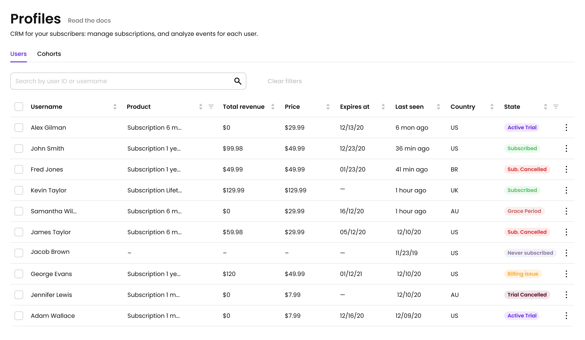
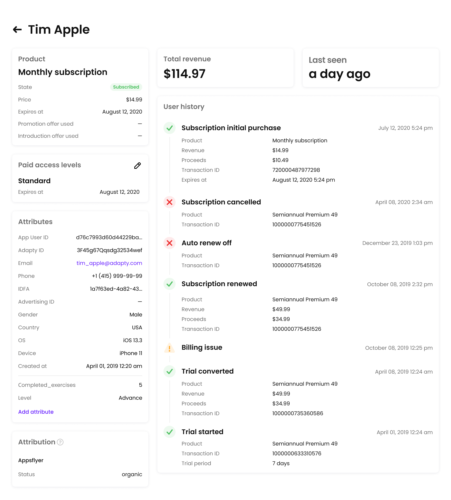

# Profiles/CRM

Profiles is a CRM for your users. With Profiles you can:

1. Find a user with any ID you have including email and phone number
2. Explore full payment path of a user including billing issues, grace periods and more [events](../analytics/integrations/events.md)
3. Analyze users properties such as subscription state, total revenue/proceeds, last seen and more below
4. Grant user a subscription

In a full table of subscribers you can filter, sort and find users. State describes user state in terms of subscription and can be

* **Subscribed**. User has an active subscription
* **Active trial**. User in has a subscription with active trial
* **Auto renew off**. A user turned off auto renew. Check [events](../analytics/integrations/events.md) for more info
* **Subscription cancelled**. User cancelled subscription. Check [events](../analytics/integrations/events.md) for more info
* **Trial cancelled**. User cancelled a trial
* **Never subscribed**. User never subscriber i.e. he's a freemium user
* **Billing issue**. User is unable to be charged
* **Grace period**. User entered a grace period

You can group users into Segment to make a [promo campaigns](promo-campaigns.md), group analysis and more



### Users properties

You can send any properties that you want for the user. Find in [iOS SDK](https://github.com/adaptyteam/AdaptySDK-iOS) how to do it.

By default Adapty set

* **App User ID**. Is a developer ID and can be any string
* **Adapty ID**. Internal ID of a user in Adapty
* **IDFA**
* **Country**
* **OS**
* **Device**
* **Created at**. Profile creation date
* **Last seen**

For better understanding your user we suggest to send at least your internal user ID or user email. This will help you a lot to find a user.

After installing [Adapty SDK](https://github.com/adaptyteam/AdaptySDK-iOS) Adapty automatically collect user [events](../analytics/integrations/events.md) from payment queue and display them in a user profile.

### Custom attributes

You can see custom attributes that were set either from [SDK](https://github.com/adaptyteam/AdaptySDK-iOS/blob/master/Documentation/AdvancedUsage.md#update-your-user-attributes) and manually assign them to the user using the Add attribute button in the Attributes section on the profile page.

### Grant a subscription

In a profile you can find an active subscription. In any time you can prolong users subscription or grant a lifetime access. 

It's most useful for users without an active subscription so you can grant individual user of a group of users a premium features for some time.


Expires at must be a date in the future and ones set it can't be decreased




