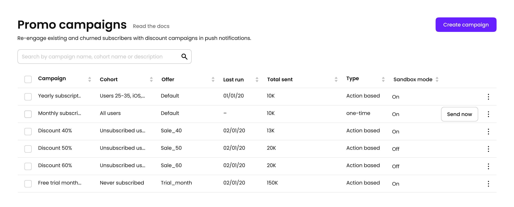

# Promo Campaigns

Promo Campaigns designed for upselling in your app. Send promo offers with automated campaigns in push notifications. To start:

* Create a [Segment](segments.md) or use predefined
* Target a deal with [Container](../purchase-infrastructure/ab-tests.md)
* Set a trigger for sending a push


Promo offers are sent _only once per campaign per user._ So you can't accidentally DDOS your user with many pushes. Each user can receive only one message for a given campaign. If you need to send multiple pushes, just create another campaign.


### 

### Before you start


Make sure to [add your certificate](../settings/ios-sdk.md#push-notifications) for sending Push notifications. Without it, Promo campaigns won't work


### 

### Creation

[Add your push certificate](../settings/ios-sdk.md#push-notifications), create a [segment](segments.md), and [Container](../purchase-infrastructure/ab-tests.md#creation).

There are two ways to send a push with a promo offer:

1. Action-based. Choose the [event](../analytics/integrations/#events) and Adapty will send a promo offer right after the event was triggered
2. One-time. No auto trigger is set, you can only manually trigger sending a push from a table view

Also, you can set a delay for sending push notifications. This could be especially useful in the action-based campaigns so users don't feel tracked so much.

You can use Send now button multiple times, but only new users will receive the offer.

