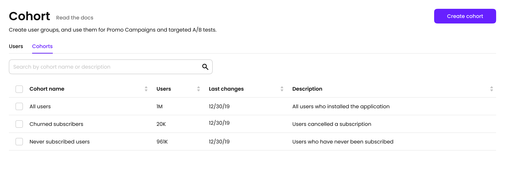

# Segments

A Segment is a group of users with common properties.

Segments are used in [promo campaigns](promo-campaigns.md), [A/B Tests](../purchase-infrastructure/ab-tests.md). Adapty has predefined segments:

* Non subscribed users. Freemium users that never subscribed
* Subscription cancelled users
* Trial cancelled users

### Creation

To create a segment, write a segment name, and choose attributes.

### Available attributes

* Age
* Calculated subscription state
* Calculated total revenue USD
* Country from ip
* Country from store account
* Creation date
* Device
* Gender
* OS
* Platform
* Subscription expiration date
* Subscription product
* Attribution Source: Organic, Non-Organic, Unknown
* Attribution Channel
* Attribution Campaign
* Attribution Ad Group
* Attribution Ad Set
* Attribution Creative
* [Custom attributes](profiles.md#custom-attributes)

