# A/B Test

A/B tests help you to increase the revenue. You can show different products or designs to users, compare the metrics, and find out the best-selling combination.

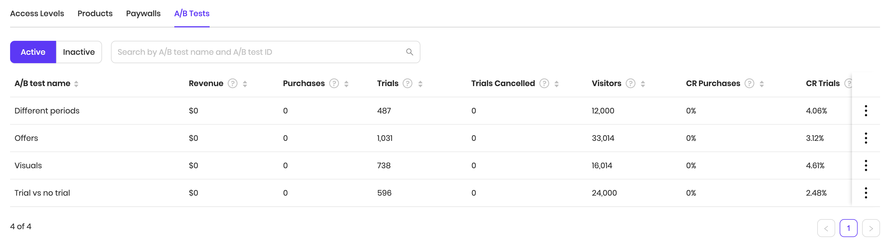

### **Creating an A/B test**

When creating an A/B test, you have to choose the paywall, which will be converted to an A/B test. This way, you can start using a single paywall and then add other options without having to release a new version of your app.

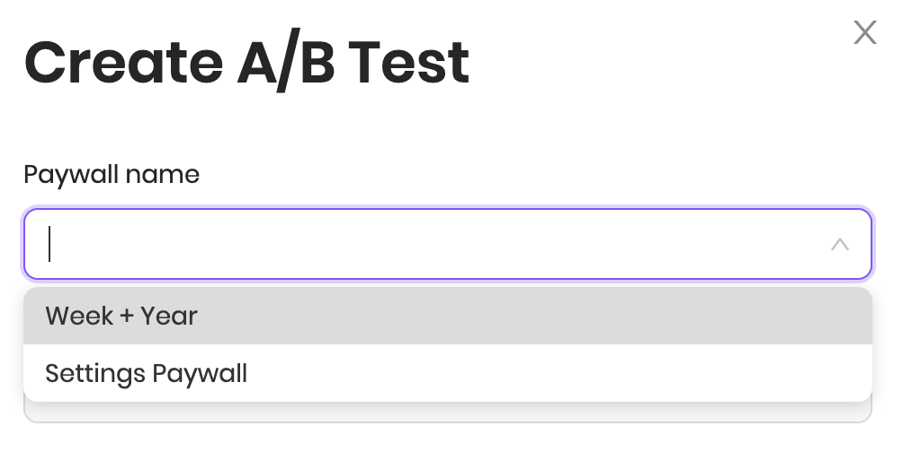

After choosing the paywall to convert, you need to add at least one more paywall to an A/B test. This is because to test something, we need at least two options to compare. You will also need to give A/B test a name and, optionally, description.

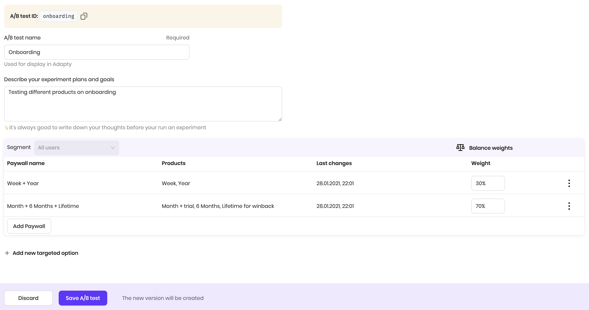


When creating an A/B test from the existing paywall, you can't change the A/B test ID. It's automatically copied from the paywall. This way you don't have to change anything on the SDK side.


\*\*\*\*

### **A/B test options**

A/B test must have at least two options. An option is a paywall. In the example, the A/B test consists of two paywalls: Week + Year and Month + 6 Months + Lifetime. These are custom names that we've chosen for our paywalls. The first paywall has two products, the second has 3 products.

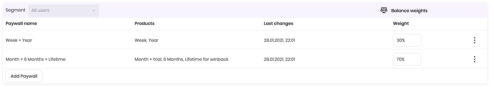

Every paywall within the A/B test has the weight. Weight represents the relative amount of views this paywall will get when running the A/B test. If the first paywall has 30% weight, and the second one has 70%, this means that the first gets 3 views out of ten, and the second gets 7 views. The sum of all weights must be 100.

You can use _Balance weights_ button to evenly distribute the weights of the options.

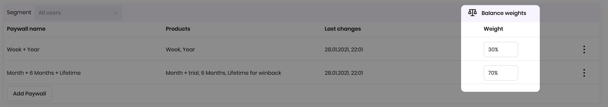

To add a paywall to the A/B test, click Add Paywall button, create a paywall, and it'll be assigned to the A/B test.


A/B tests contain multiple paywalls, but on the SDK side, you will always receive one paywall for the A/B test. Adapty chooses the paywall to show to the user according to weight and targeting on the server-side. That's why you can use **`.getPaywalls()`** method to receive paywalls directly or from A/B tests.


### 

### Targeted A/B test options

By default, the A/B test is live for all users of the app. But sometimes you want to run an A/B test on a specific segment of users. For example, you want to provide a discount for users who cancelled a subscription.

You can do it using a targeted option. First, choose the [segment](../profiles-and-promo-campaigns/segments.md) you want to target. And then add the paywalls as usual.

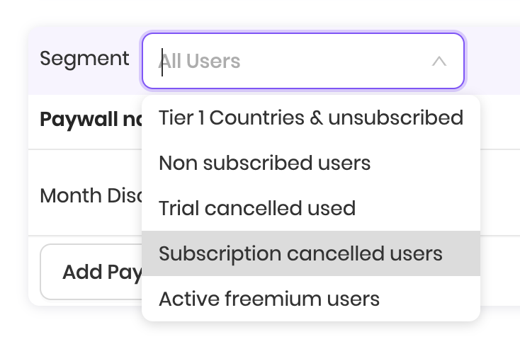

We've added a targeted option for the users who cancelled a subscription. Keep in mind, that All users segment must be always targeted \(you can't delete this option\). With the setup below, a user with a cancelled subscription will be always \(100%\) shown the Month Discount paywall. If a user doesn't have a cancelled subscription, he'll be shown the paywalls from the All users target option. Targeted options may contain multiple paywalls, just as the normal ones.

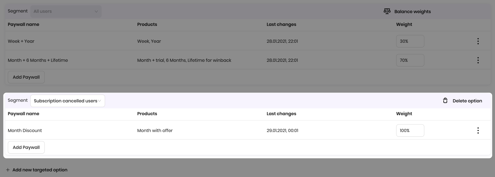


You can create multiple targeted options within an A/B test. If the customer belongs to multiple segments, Adapty will use the one with the least number of users in it. ****If the customer doesn't belong to any targeted option, he'll be shown the paywall from the All users target option.



You can use predefined segments for targeted options. You can also create custom segments tailored to your needs. For example, you can create a segment for people from a specific ad campaign, source, or country. You can even use your app logic parameters to create a segment. For example, users who are interested in sports or users who completed 10 lessons.  
  
Learn more about these options in the [Segments](../profiles-and-promo-campaigns/segments.md) section.


### \*\*\*\*

### **Versioning**

Every time the paywalls, weights, or targeted options are changed, the new version of the A/B test is created. This is done to collect A/B test metrics separately for every meaningful change. The list of the A/B test shows the metrics for the latest \(current\) version of the A/B test. You can view the metrics for every version of the A/B test on the Paywall metrics page.

### Metrics

Adapty collects plenty of metrics to help you better measure the performance of the A/B test. All metrics are updated in real-time, except for the visitors, which are updated once every several minutes. All metrics except for the visitors are attributed to the product within the paywall.

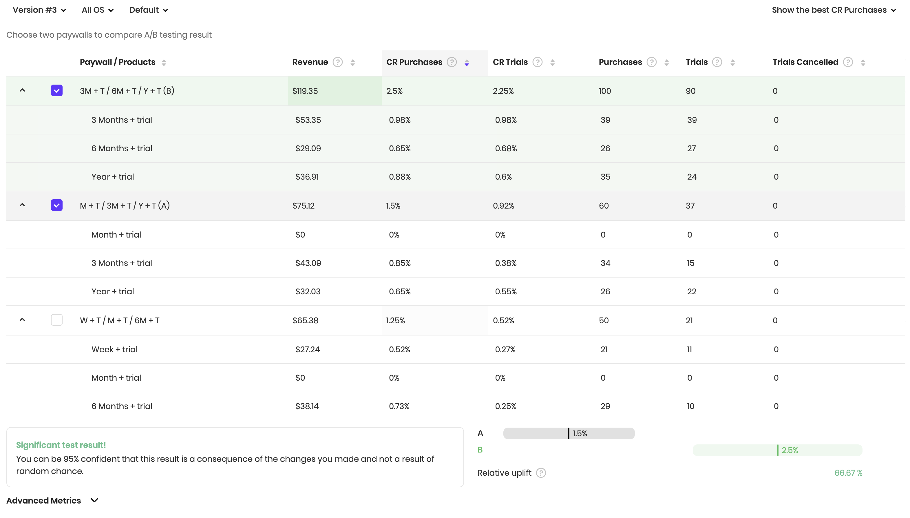

* **Revenue** is the amount of money in USD from the purchases made directly on the paywall \(renewals are not included\). It's calculated before the App Store / Play Store commission. The following events affect revenue:
  * New purchases made on the paywall;
  * Trial conversions of trials that were activated on the paywall;
  * Down/up/cross-grades of the subscription on the paywall;
  * Subscription restores on the paywall \(e.g. if the subscription was expired without auto-renewal\).
* The **conversion rate \(CR\) to purchases** is the number of purchases divided by the number of visitors. 10 purchases / 100 visitors = 10% CR purchases.
* The **conversion rate \(CR\) to trials** is the number of trials started divided by the number of visitors. 30 trials / 100 visitors = 30% CR trials.
* **Purchases** are the sum of the following transactions \(renewals are not included\):
  * New purchases made on the paywall;
  * Trial conversions of trials that were activated on the paywall;
  * Down/up/cross-grades of the subscription on the paywall;
  * Subscription restores on the paywall \(e.g. if the subscription was expired without auto-renewal\).
* **Trials** are the number of activated trials
* **Trials cancelled** are the number of trials with auto-renewal switched off. It happens when the user manually unsubscribes from the trial.
* **Visitors** are the number of views of the paywall. If the user visits the paywall two times, this will be counted as two visits.


Make sure to send paywall views to Adapty using **.logShowPaywall\(\)** method. Otherwise, paywall views will not be accounted for in the metrics and conversions will be irrelevant.

Read instructions for [iOS](../sdk/integrating-adapty-sdk/ios-sdk-intro/ios-sdk-displaying-products.md#paywall-analytics), [Android](../sdk/integrating-adapty-sdk/android-sdk-intro/android-sdk-displaying-products.md#paywall-analytics), [Flutter](../sdk/integrating-adapty-sdk/flutter-sdk-intro/flutter-sdk-displaying-products.md#paywall-analytics).


You can view the A/B test metrics for every version, platform \(OS\), and targeted option.

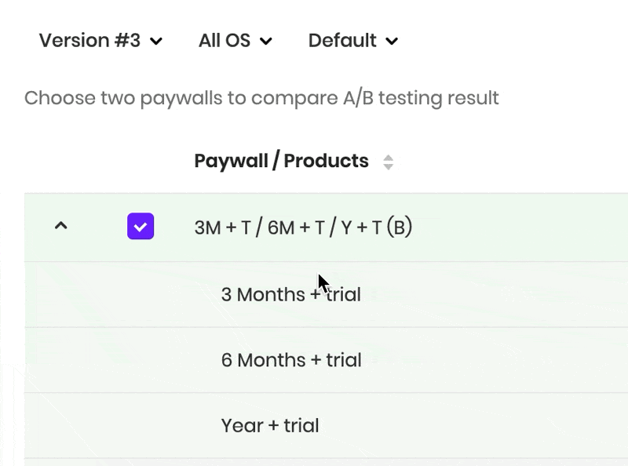

The best performing option is highlighted in green. By default, the best one chosen based on the revenue. You can choose the other options at the right top corner of the metrics.

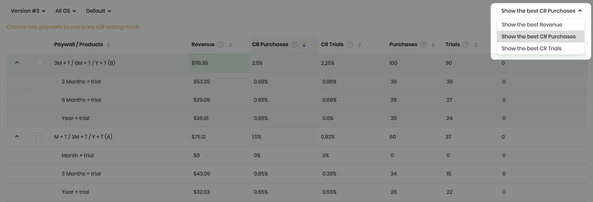

You can also change the sorting of the table by clicking on the label.

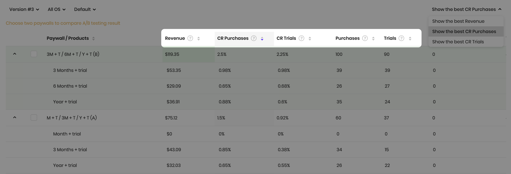

When you choose two options to compare by clicking checkboxes next to the titles, Adapty will show you whether one of them is significantly better than the other. If so, it usually means that you can stop testing these options and choose the best one.

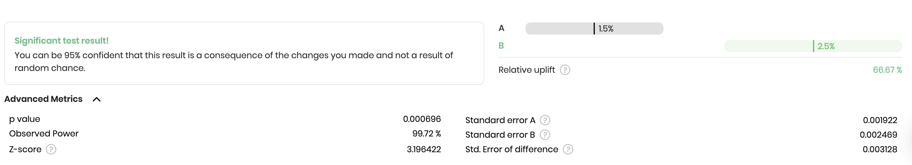

### Stopping an A/B test

Once you've discovered the best performing option, you may want to stop an A/B test. Stopping an A/B test is essentially converting it to a paywall. This means that all users of your app will see the same products.

To stop an A/B test click _Stop A/B test_ at the right top corner of the A/B test editor.

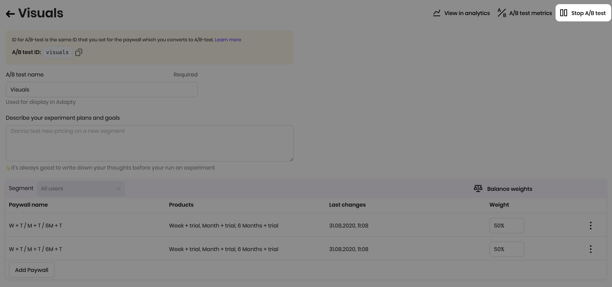

You'll be asked to choose the paywall you want to keep.

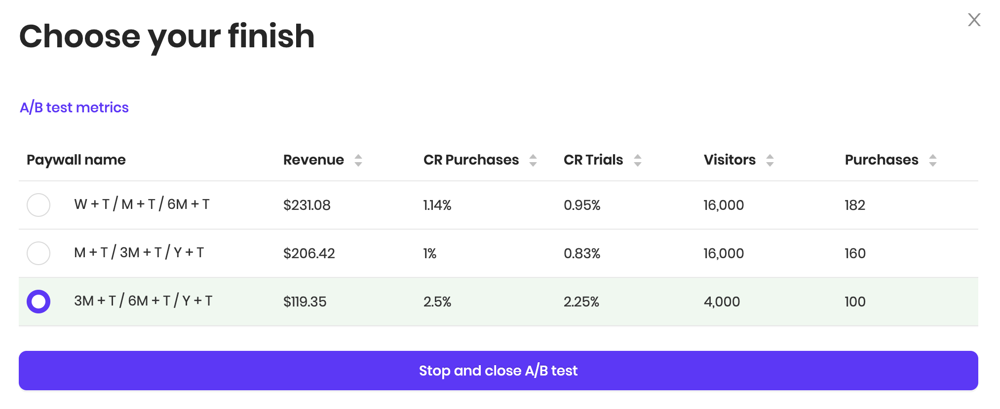

All stopped A/B tests are stored in the Inactive tab, and you can still view the metrics.

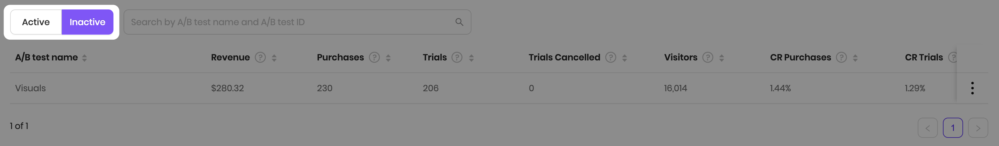

