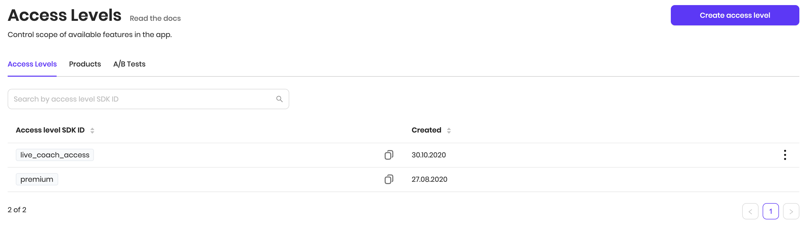
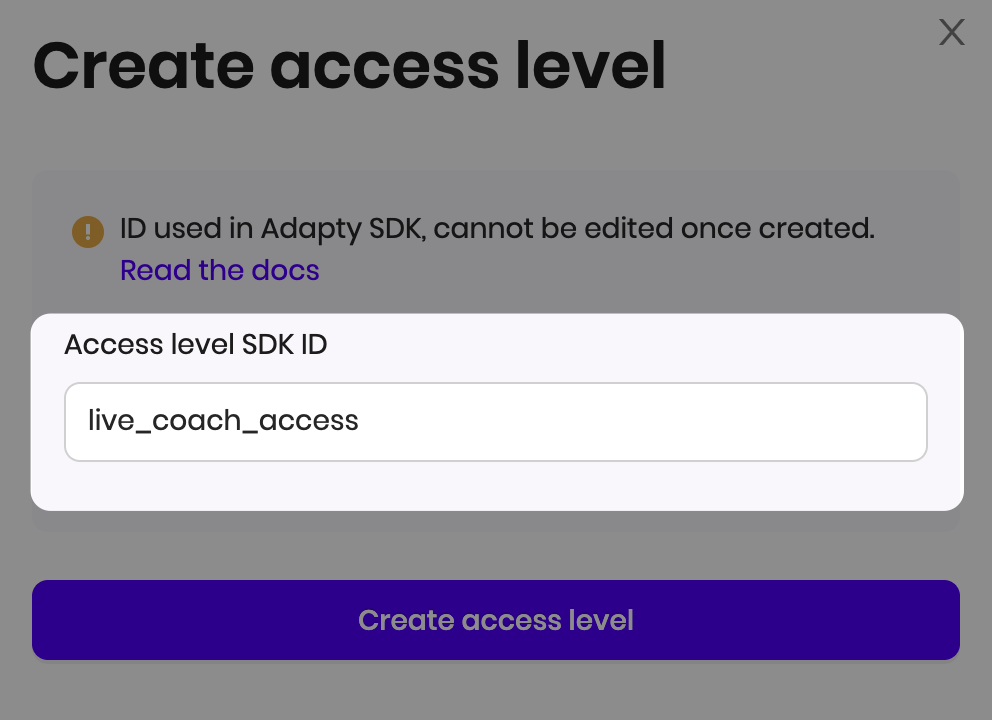
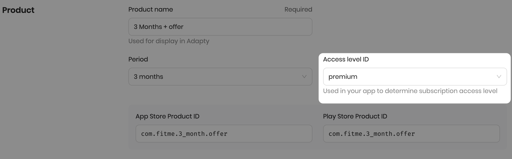
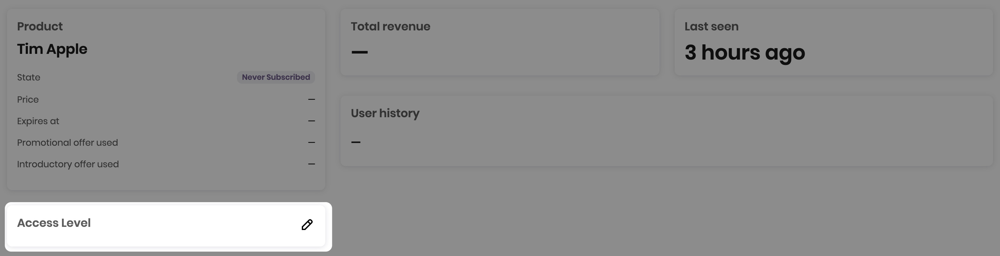
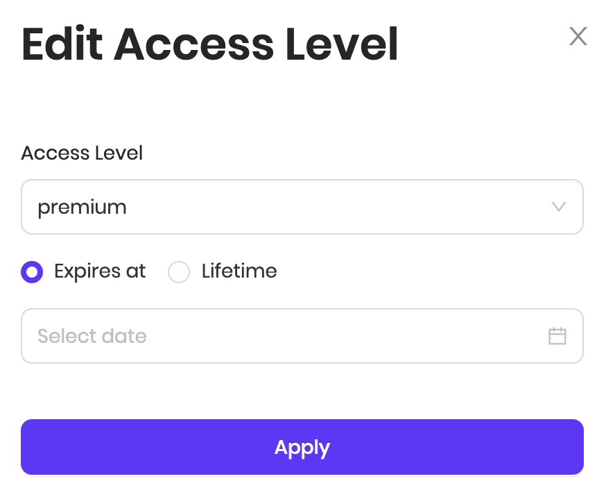

# Access Level

Access levels allow you to control features available to the customers of your app without hardcoding product ids. Every time the user makes a purchase, Adapty unlocks access to the app for the specific period \(subscriptions\) or for a lifetime \(lifetime purchases\).



When you create the app in Adapty Dashboard, we will automatically create an access level for you with an id **`premium`**. This is a default access level, you can't delete it. In most cases, you'll only need one access level. You can check whether the customer has a specific access level like this:



```swift
Adapty.getPurchaserInfo { (purchaserInfo, state, error) in
    if error == nil {
        // "premium" is an identifier of default access level
        if purchaserInfo?.accessLevels["premium"]?.isActive == true {
            // grant access to premium features
        }
    }
}
```



```kotlin
Adapty.getPurchaserInfo { purchaserInfo, error ->
    if (error == null) {
        // "premium" is an identifier of default access level
        if (purchaserInfo?.accessLevels["premium"]?.isActive) {
            // grant access to premium features
        }
    }
}
```



```kotlin
try {
    GetPurchaserInfoResult getPurchaserInfoResult = await Adapty.getPurchaserInfo();
    // "premium" is an identifier of default access level
    if (getPurchaserInfoResult?.purchaserInfo?.accessLevels['premium'].isActive) {
        // grant access to premium features
    }
} on AdaptyError catch (adaptyError) {}
catch (e) {}
```



You can have multiple access levels per app. This is how you can use multiple access levels:  

* A newspaper app and sell subscriptions to different topics independently, you can create access levels "sports" and "science".
* A fitness app with recorded video training, available after purchasing a regular subscription \(using default "premium" access level\). But the customers can subscribe to the more expensive option, which gives access to live training with a coach. In this case, you can create a "live\_coach\_access" level.
* A language learning app the access level for each of the available languages.

### 

### Creating access level

To create an access level you only need to enter its ID, which will be used in SDK.



### 

### Assigning access level to a product

The access level is linked with a [Product](product.md), so when a user makes a purchase, he's automatically given the linked access level. Adapty will automatically detect subscription duration, and it will be set to access level as an expiration date. If you create a lifetime product, and a customer purchases it, the access level won't have an expiration date and will be active forever.



### 

### Giving access level to the customer in Adapty Dashboard

You can manually set the access level for a specific customer in Adapty Dashboard. This is useful for support, eg. if you want to gift an extra week of premium usage for the user who wrote you an overwhelming review.





Choose which access level you want to grant and the expiration date or lifetime unlock.


### Setting customer's access via API

You can also grant an access level to the customer from your server using Adapty API. This is useful if you have a bonus for invites or other product-related events. Read more about it in the [API Specs](../server-side-api/api-specs.md#prolong-grant-a-subscription-for-a-user) section.

