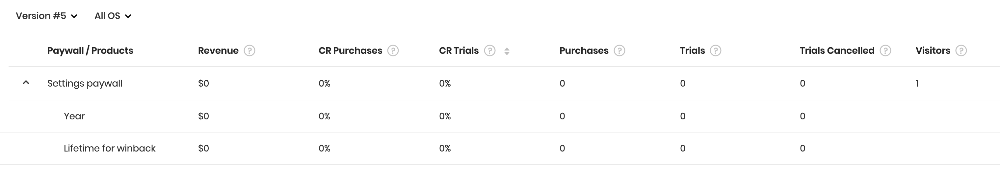

# Paywall

A Paywall is a set of products. Paywalls allow you to dynamically change the products shown to your customers without app releases.


### Paywall structure

A paywall consists of a name, a unique ID, ordered products, and optionally custom JSON payload. A paywall name is used across Adapty Dashboard.


### Paywall ID

Paywall ID is unique within the app. This identifier is used in Adapty SDK and can't be edited once created. Most likely it will resemble a paywall name.


On the SDK side, it's called **`developerId`** \(heard of legacy? 😎\). Here is an example of using it:



```swift
var paywall: PaywallModel?
Adapty.getPaywalls { (paywalls, _, error) in
    paywall = paywalls?.first(where: { $0.developerId == "main" })
    let product = paywall?.products.first
}
```



```kotlin
Adapty.getPaywalls { paywalls, _, error ->
    val paywall: PaywallModel? = paywalls?.firstOrNull { it.developerId == "main" }
    val product = paywall?.products?.firstOrNull()
}
```



```dart
void foo() async {
  try {
    final GetPaywallsResult getPaywallsResult = await Adapty.getPaywalls(forceUpdate: false);
    final paywall = getPaywallsResult.paywalls?.firstWhere((element) => element.developerId == 'main');
    final product = paywall?.products?.first;
  } on AdaptyError catch (adapryError) {} catch (e) {
    print(e.toString());
  }
}
```



In this example, we get all the paywalls, then find the one with the identifier **`main`**  \(it can be anything, you should use yours\). Finally, we retrieve the first product from the paywall. You can then display it to your customer.


### Products

Products are an ordered set of products, which will be shown to your customer.


You can add up to 5 products to a paywall. The order of the products is preserved on the SDK side, so keep it in mind when configuring a paywall. You can optionally specify an Apple [promotional offer](https://developer.apple.com/documentation/storekit/in-app_purchase/implementing_subscription_offers_in_your_app) for the product.


Make sure to indicate [Bundle ID](https://app.adapty.io/settings/ios-sdk) for iOS and [Package Name](https://app.adapty.io/settings/android-sdk) for Android in Adapty Dashboard, without them SDK can't fetch product info from stores.



Since the paywalls are configured remotely, the available products, the number of the products, and the special offers \(eg free trials\) can change over time. Make sure your code handles these scenarios. For example, if you get 2 products, the 2 products will be displayed, but when you get 3, all of them should be displayed without code changes.

**Don't hard code product ids**, you won't need them.



To use promotional offers, you have to [upload Subscription Key](../settings/ios-sdk.md#subscription-key) to Adapty Dashboard, so Adapty can sign the offers.


### 

### Custom JSON payload

If you'd like to further customize your paywall, a custom JSON payload may be useful to you.


You can enter any JSON formatted data up to 4 kB. You can access this data from SDK using **`customPayload`** or **`customPayloadString`** properties of **`PaywallModel`** , and make some adjustments to your paywall. Here are some examples of how you can use a custom payload.



```text
{
    "screen_title": "Today only: Subscribe, and get 7 days for free!"
}

# Test titles or others texts
```



```text
{
    "background_image": "https://adapty.io/media/paywalls/bg1.png"
}

# Test images on your paywall
```



```
{
    "font_family": "San Francisco",
    "font_size": 16
}

# Test fonts
```



```
{
    "subscribe_button_color": "purple"
}

# Test colors of buttons, texts etc.
```



```
{
    "photo_gallery": "https://adapty.io/media/paywalls/link-to-html-snippet.html"
}

# Any HTML code that can be displayed on the paywall
```



```
{
    "hard_paywall": true
}

# By setting it to true, you disalow skipping paywall without subscribing
# You have to handle this logic in your app
```



```
{
    "title": {
        "en": "Try for free!",
        "es": "¡Prueba gratis!",
        "ru": "Попробуй бесплатно!"
    }
}
```



You can combine different options, and make up your own. This way you can test different titles, texts, images, fonts, colors, and so on.


### Versioning

Every time the products or custom JSON payload are changed, the new version of the paywall is created. This is done to collect paywall metrics separately for every meaningful change. The list of the paywalls shows the metrics for the latest \(current\) version of the paywall. You can view the metrics for every version of the paywall on the Paywall metrics page.


### Metrics

Adapty collects plenty of metrics to help you better measure the performance of the paywalls. All metrics are updated in real-time, except for the visitors, which are updated once every several minutes. All metrics except for the visitors are attributed to the product within the paywall.



* **Revenue** is the amount of money in USD from the purchases made directly on the paywall \(renewals are not included\). It's calculated before the App Store / Play Store commission. The following events affect revenue:
  * New purchases made on the paywall;
  * Trial conversions of trials that were activated on the paywall;
  * Down/up/cross-grades of the subscription on the paywall;
  * Subscription restores on the paywall \(e.g. if the subscription was expired without auto-renewal\).
* The **conversion rate \(CR\) to purchases** is the number of purchases divided by the number of visitors. 10 purchases / 100 visitors = 10% CR purchases.
* The **conversion rate \(CR\) to trials** is the number of trials started divided by the number of visitors. 30 trials / 100 visitors = 30% CR trials.
* **Purchases** are the sum of the following transactions \(renewals are not included\):
  * New purchases made on the paywall;
  * Trial conversions of trials that were activated on the paywall;
  * Down/up/cross-grades of the subscription on the paywall;
  * Subscription restores on the paywall \(e.g. if the subscription was expired without auto-renewal\).
* **Trials** are the number of activated trials
* **Trials cancelled** are the number of trials with auto-renewal switched off. It happens when the user manually unsubscribes from the trial.
* **Visitors** are the number of views of the paywall. If the user visits the paywall two times, this will be counted as two visits.


Make sure to send paywall views to Adapty using **.logShowPaywall\(\)** method. Otherwise, paywall views will not be accounted for in the metrics and conversions will be irrelevant.

Read instructions for [iOS](../sdk/integrating-adapty-sdk/ios-sdk-intro/ios-sdk-displaying-products.md#paywall-analytics), [Android](../sdk/integrating-adapty-sdk/android-sdk-intro/android-sdk-displaying-products.md#paywall-analytics), [Flutter](../sdk/integrating-adapty-sdk/flutter-sdk-intro/flutter-sdk-displaying-products.md#paywall-analytics).



You can view the paywall metrics for every version and platform \(OS\).


### Deleting paywall

To delete the paywall, open it, click _Delete paywall_, and confirm the action by entering the paywall name you're about to delete.


All deleted paywalls are stored in the Inactive tab, and you can still view the metrics.



Deleting the paywall will delete it from SDK. Don't delete paywalls that are used in production, it may break your app logic. You won't be able to restore the paywall after deleting it.



### Converting paywall to A/B test

When you ready to test different products or designs, you can convert an existing paywall to an A/B test. The best thing is that you don't have to change anything on the SDK side. This way, you can start using a single paywall and then add other options without having to release a new version of your app.

To convert a paywall to an A/B test, click _Convert to A/B test_ at the right top corner of the paywall editor.


Learn more about working with A/B tests in the [next section](ab-tests.md).



