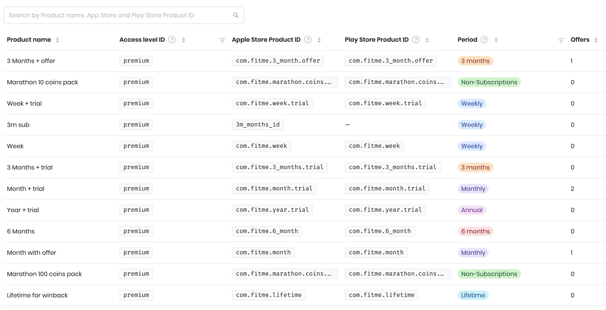
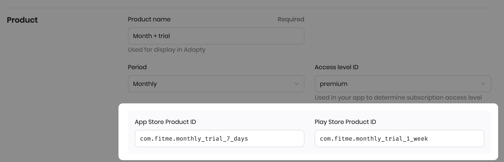
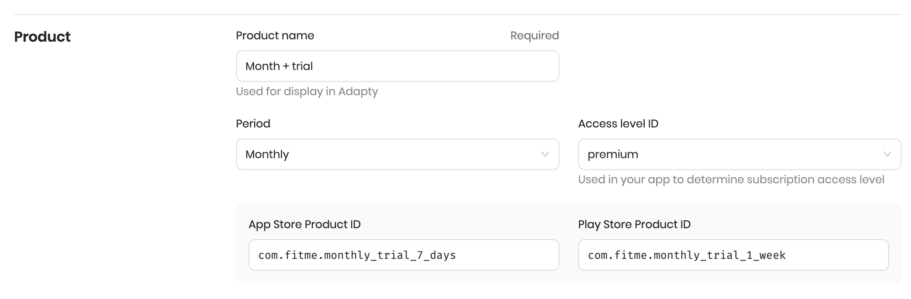
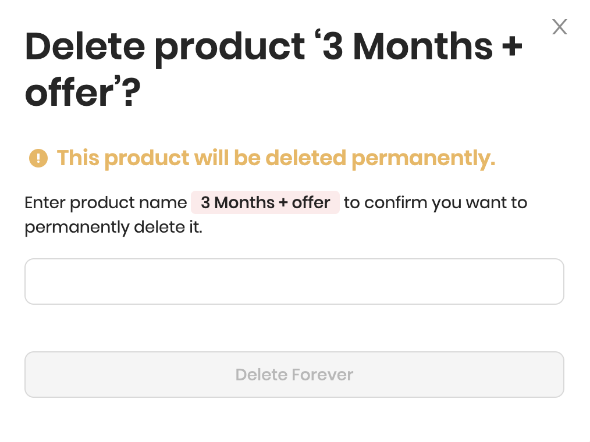
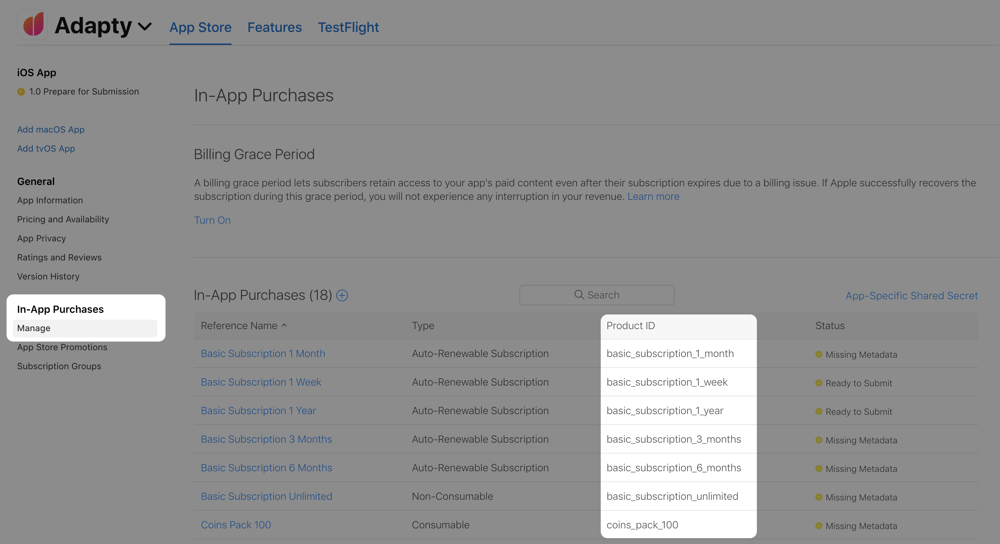
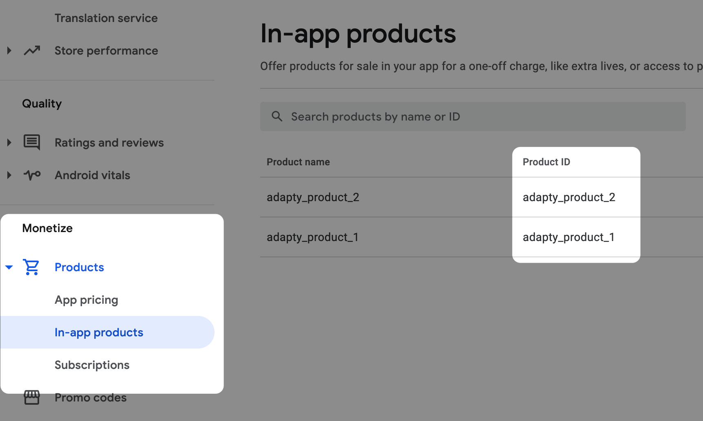
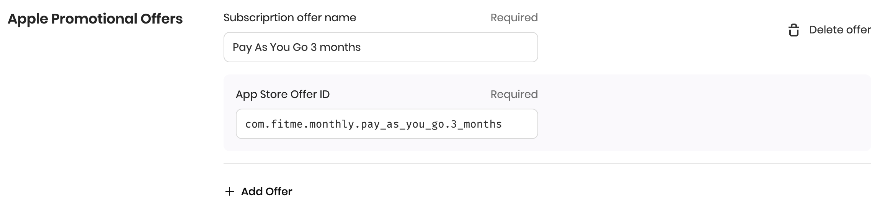

# Product

Adapty encapsulates products from App Store and Play Store into a single internal product. This allows you to use a single Adapty product across all platforms, instead of using each vendor's products.

This product has an App Store ID **`com.fitme.monthly_trial_7_days`** and Play Store ID **`com.fitme.monthly_trial_1_week`**.


Make sure to indicate [Bundle ID](https://app.adapty.io/settings/ios-sdk) for iOS and [Package Name](https://app.adapty.io/settings/android-sdk) for Android in Adapty Dashboard, without them SDK can't fetch product info from stores.


### Product management

#### Create

To create a product you need to fill in at least one vendor ID. If you [add App Store Connect](../settings/app-store-connect.md) credentials, Adapty will import all existing products for you automatically. 


Adapty supports all types of products: subscriptions, non-consumable \(including lifetime\), and consumable.


* The **Product name** is used across Adapty Dashboard.
* The **Period** is used to determine the duration of the subscription. It should match the period configured in the App Store or Play Store. If the product is not a subscription, use the following options:
  * **`Lifetime`**

    Use a lifetime period for the products that unlock premium features of the app for a lifetime \(forever\).

  * **`Non-Subscriptions`**

    For the products that are not subscriptions and therefore have no duration, use non-subscriptions. These can be unlocks for additional features, consumable products, etc.


By default, all the products have an **`Uncategorized`** period. Make sure to set the correct one, otherwise, there might be problems with granting access to your customers.


* The **Access Level** is used to determine the features unlocked after purchasing the product. Most of the time **`premium`** access level should be used. You can read more about access levels [here](access-level.md).
* **App Store Product ID** and **Play Store Product ID** are identifiers of the product from the stores. You have to fill in at least one of them and you'll be able to add another one later if needed.

#### Edit

To edit the product, open it, enter the new values, and click _Save_.


Editing period, access level, App Store Product ID, and Play Store Product ID is not recommended because it may affect analytics clarity. Only edit them if you made a mistake, like setting the wrong period or typo in the product ID.

If you no longer use the product and want to replace it with another one, it's much better to create a new product and update Paywalls and A/B Tests accordingly.


#### Delete

To delete the product, open it, click _Delete Product_, and confirm the action by entering the product name you're about to delete.


Deleting the product is not recommended because it will affect analytics clarity. If you want to fix a typo, change the period or access level, you can edit them.



You can't delete the product which is assigned to the active paywall. You have to create a new version of the paywall without the product first.


### 

### How to find an iOS product ID?

Open [App Store Connect](https://appstoreconnect.apple.com/) and choose the app. Go to _In-App Purchases_ -&gt; _Manage_.

### How to find Android product ID?

Go to [Play Store](https://play.google.com/apps/publish) and choose the app. Scroll the left menu up to the _Monetize_ section. Under the _Products_ choose either _In-app products_ or _Subscriptions_.

### Apple promotional offers

With iOS 13 Apple released [Promotional offers](https://developer.apple.com/documentation/storekit/in-app_purchase/subscriptions_and_offers/implementing_promotional_offers_in_your_app) as a way to promote your users to subscribe. Adapty supports Subscription offers.


To use promotional offers, you have to [upload Subscription Key](../settings/ios-sdk.md#subscription-key) to Adapty Dashboard, so Adapty can sign the offers.


To add a promotional offer to your product click _Add Offer_ and enter its **Name** and **Offer ID** from App Store.

