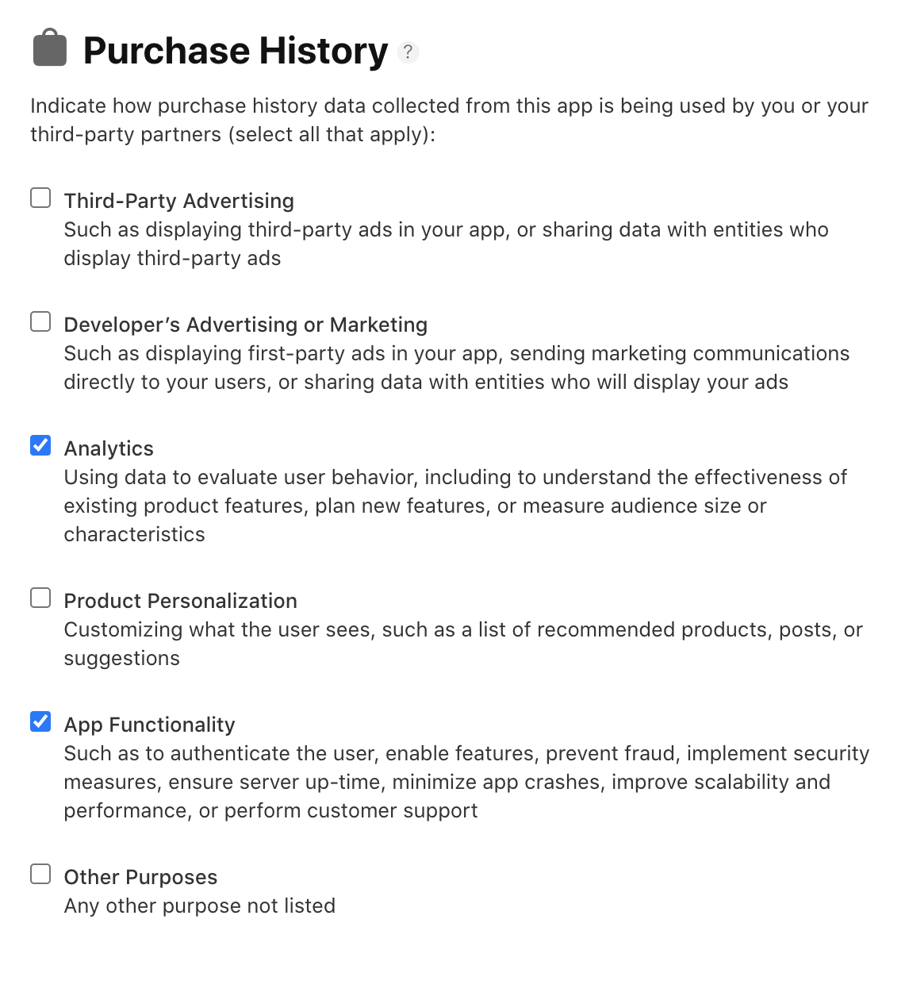
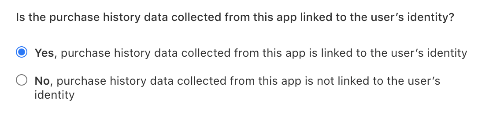
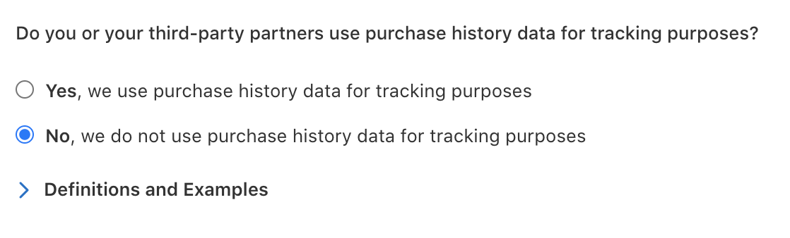
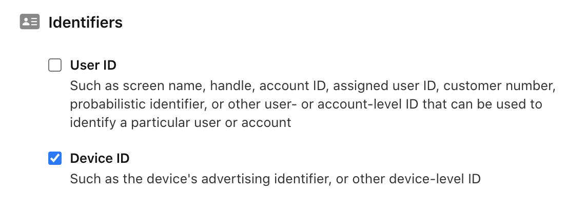
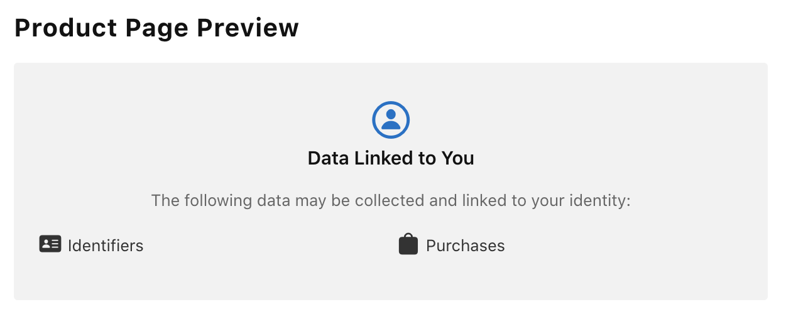

# Apple App Privacy

Starting December 8, 2020, Apple requires a privacy disclosure for all new apps and app updates. Adapty is a third-party dependency to your app, therefore you’ll need to properly disclose the ways you are using Adapty in regards to user's data.

## Data Types

✅ = Required  
👀 = May be required \(see details below\)  
❌ = Not required

<table>
  <thead>
    <tr>
      <th style="text-align:left">Data Type</th>
      <th style="text-align:left">Required</th>
      <th style="text-align:left">Comment</th>
    </tr>
  </thead>
  <tbody>
    <tr>
      <td style="text-align:left">Identifiers</td>
      <td style="text-align:left">&#x2705;</td>
      <td style="text-align:left">
        
If you are identifying users with a <b><code>customerUserId</code></b>,
          select &apos;User ID&apos;.

        

        
Adapty collects IDFA, so you have to select &apos;Device ID&apos;.

      </td>
    </tr>
    <tr>
      <td style="text-align:left">Purchases</td>
      <td style="text-align:left">&#x2705;</td>
      <td style="text-align:left">Adapty collects purchase history from users.</td>
    </tr>
    <tr>
      <td style="text-align:left">Contact Info, including name, phone number, or email address</td>
      <td style="text-align:left">&#x1F440;</td>
      <td style="text-align:left">Required if you pass personal data like name, phone number, or email address
        using <b><code>updateProfile</code></b> method.</td>
    </tr>
    <tr>
      <td style="text-align:left">Usage Data</td>
      <td style="text-align:left">&#x1F440;</td>
      <td style="text-align:left">If you are using analytics SDK&apos;s such as Amplitude, Mixpanel, AppMetrica,
        or Firebase, this may be required.</td>
    </tr>
    <tr>
      <td style="text-align:left">Location</td>
      <td style="text-align:left">&#x274C;</td>
      <td style="text-align:left">Adapty does not collect precise location data.</td>
    </tr>
    <tr>
      <td style="text-align:left">Health &amp; Fitness</td>
      <td style="text-align:left">&#x274C;</td>
      <td style="text-align:left">Adapty does not collect health or fitness data from users.</td>
    </tr>
    <tr>
      <td style="text-align:left">Sensitive Info</td>
      <td style="text-align:left">&#x274C;</td>
      <td style="text-align:left">Adapty does not collect sensitive information.</td>
    </tr>
    <tr>
      <td style="text-align:left">User Content</td>
      <td style="text-align:left">&#x274C;</td>
      <td style="text-align:left">Adapty does not collect content from users.</td>
    </tr>
    <tr>
      <td style="text-align:left">Diagnostics</td>
      <td style="text-align:left">&#x274C;</td>
      <td style="text-align:left">Adapty does not collect device diagnostic information.</td>
    </tr>
    <tr>
      <td style="text-align:left">Browsing History</td>
      <td style="text-align:left">&#x274C;</td>
      <td style="text-align:left">Adapty does not collect browsing history from users.</td>
    </tr>
    <tr>
      <td style="text-align:left">Search History</td>
      <td style="text-align:left">&#x274C;</td>
      <td style="text-align:left">Adapty does not collect search history from users.</td>
    </tr>
    <tr>
      <td style="text-align:left">Contacts</td>
      <td style="text-align:left">&#x274C;</td>
      <td style="text-align:left">Adapty does not collect contact lists from users.</td>
    </tr>
    <tr>
      <td style="text-align:left">Financial Info</td>
      <td style="text-align:left">&#x274C;</td>
      <td style="text-align:left">Adapty does not collect financial info from users.</td>
    </tr>
  </tbody>
</table>

## Required Data Types

### Purchases

When using Adapty, you must disclose that your app collects ‘Purchases’ information.

#### 1. Purchase History

You should select at least the following options for 'Purchase History':

* Selecting ‘Analytics’ ensures compliance for Adapty's dashboard features including [CRM](../profiles-and-promo-campaigns/profiles.md) and [Analytics](../analytics/advanced-analytics.md).
* Selecting ‘App Functionality’ ensures compliance for Adapty's receipt validation in order to prevent fraud.


If you are using Adapty for any of the other options listed, such as collecting data for Third-Party Advertising, you will need to select those options as well.


After selecting the options for Purchase History, click ‘Next’.

#### 2. Purchase History Linked to Identity

Apple will then ask if you are linking purchase history to a user’s identity. If you don't set **`customerUserId`**, and don't have a way to identify individual users, you can select ‘No’.

If you are using **`customerUserId`** that can be tied to a user’s email address or phone number, you should select ‘Yes’.

#### 3. Purchase History User Tracking

Finally, to indicate if purchase history data will be used for tracking purposes, you will need to read Apple’s examples and determine if your app meets their definitions of tracking.

Adapty, as a third-party, doesn't use purchase history to track users across different apps for advertising. 

### Identifiers

If you are identifying users with **`customerUserId`**, you'll need to select 'User ID'.

Adapty collects IDFA, so you'll need to select 'Device ID'.

After making your selections, you'll need to indicate how the data is used similar to the Purchases section.

After making your privacy selections, Apple will show a preview of your app's privacy section. If you have chosen Purchases and Identifiers as described above, your app's privacy details should look something like this:

