# Android SDK

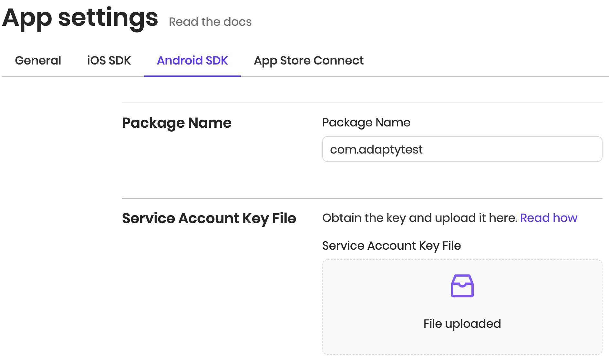

\*\*\*\*

### **Service Account Key File**

This key is used for server-side purchase verification. Obtaining the key is a bit tricky but you'll do it only once. You must be the owner of the project to proceed.

1. Open [Google Play Console settings](https://play.google.com/apps/publish#ApiAccessPlace).

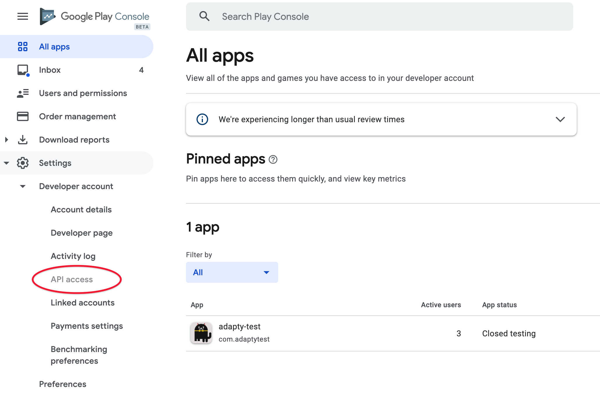

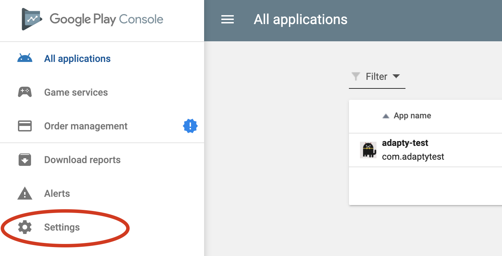

    2. Select **API access**.

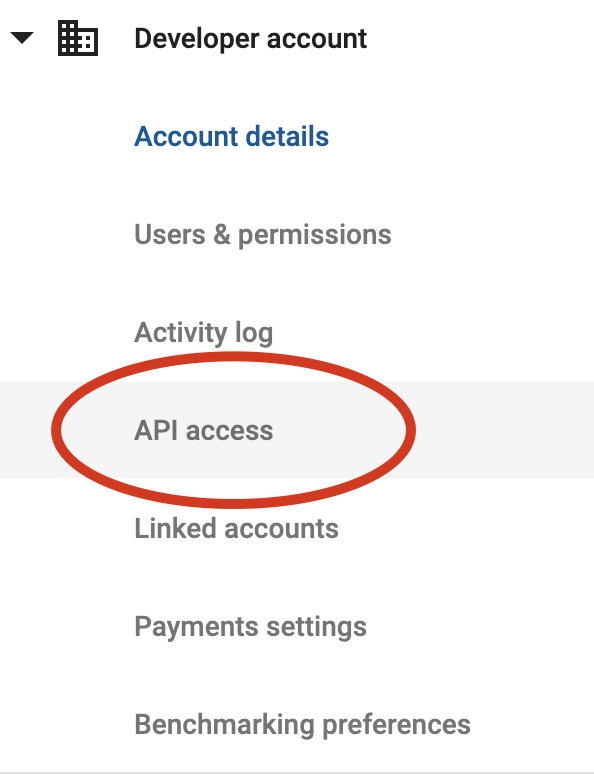

    3. Click **Link** to connect your Play account to a Google Developer Project.

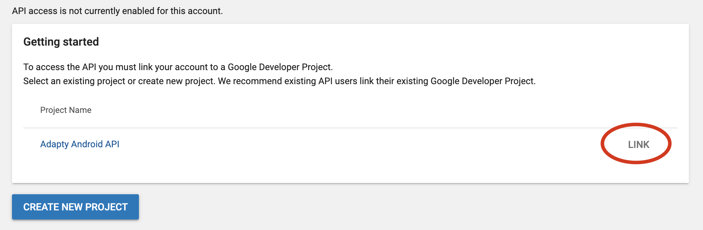

    4. Under the Service Accounts section click **Create Service Account**.

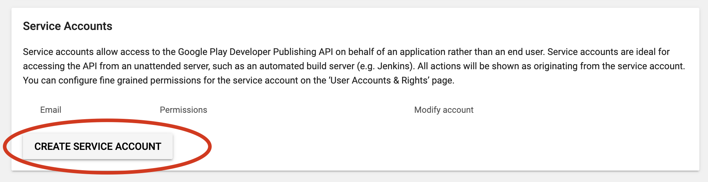

    5. Click the link to open Google API Console.

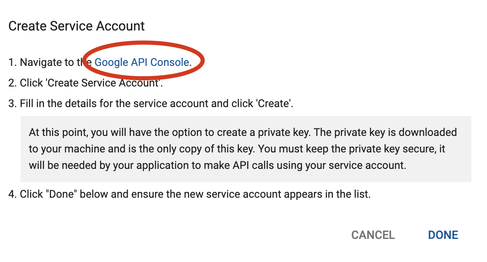

    6. Click **Create Service Account**.

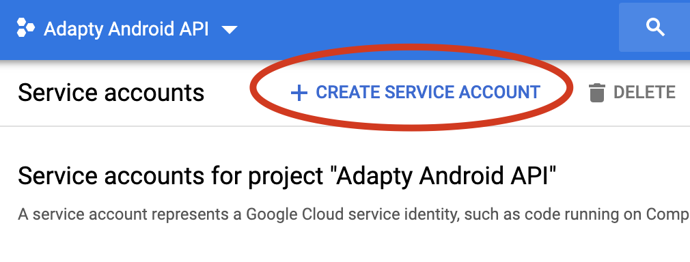

    7. Enter the name of the service account.

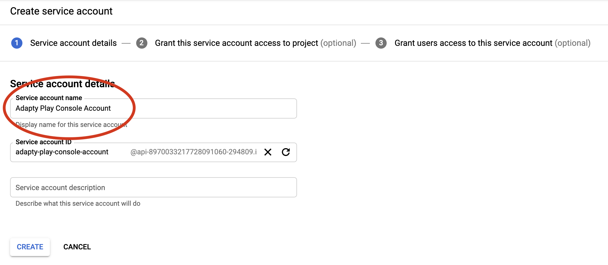

    8. Set the role to **Project** **Owner**.

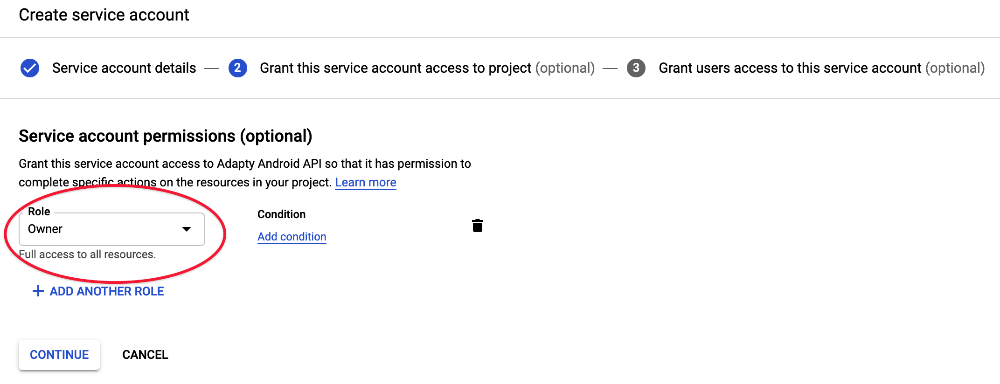

    9. Click **Create Key** and download **JSON**. This is the key you will upload to Adapty Dashboard, but you're not done yet;\)

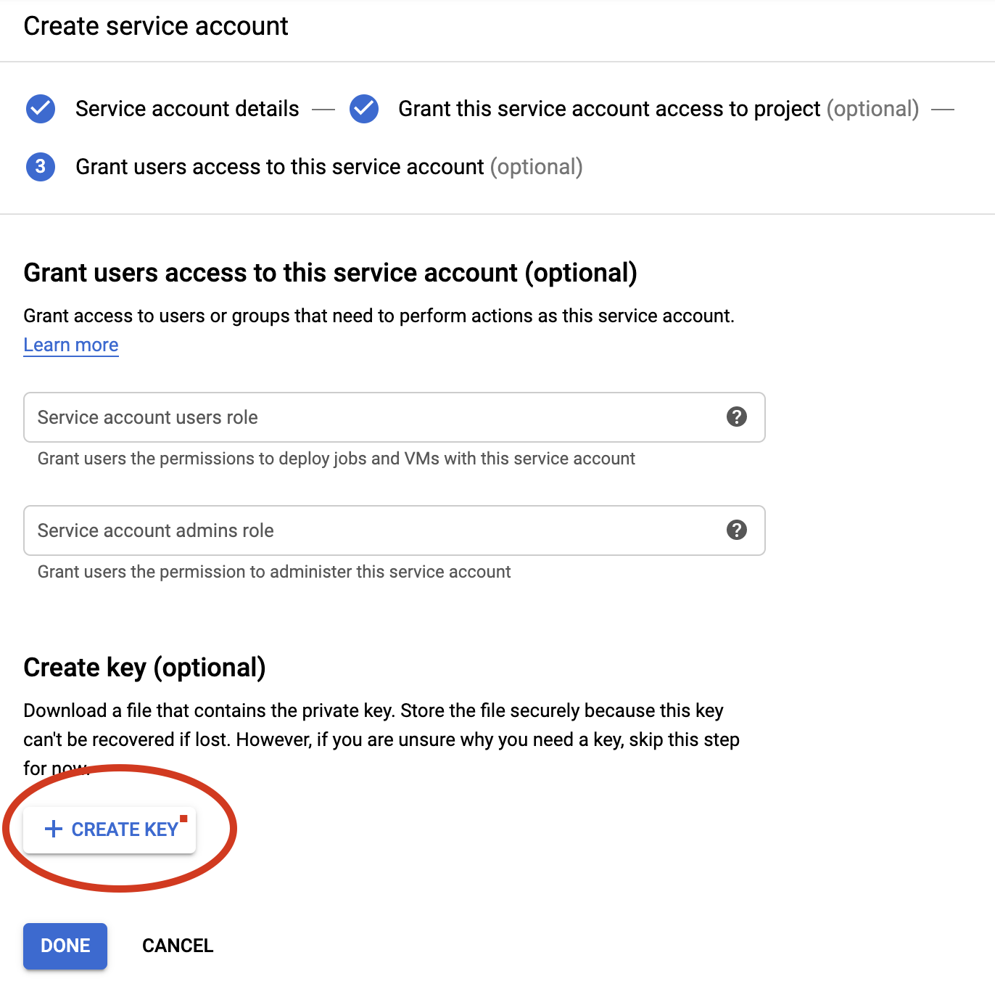

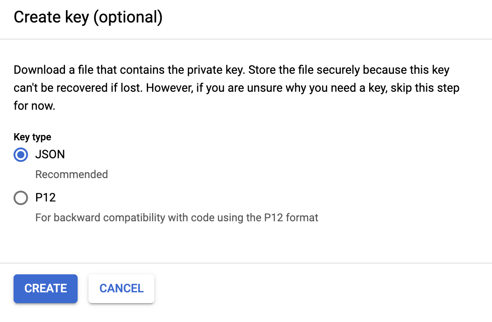

    10. Go back to Google Play Console \(API Access\) and click **Grant Access** on the service account that you've just created.

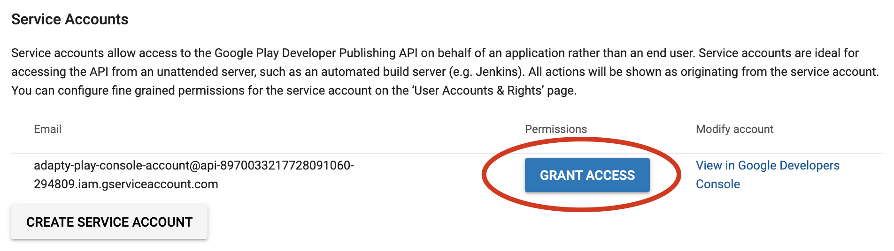

    11. Grant **View app information**, **Financial Data**, and **Store Presence** permissions and create the user. That's it, don't forget to upload JSON file to Adapty Dashboard.

 

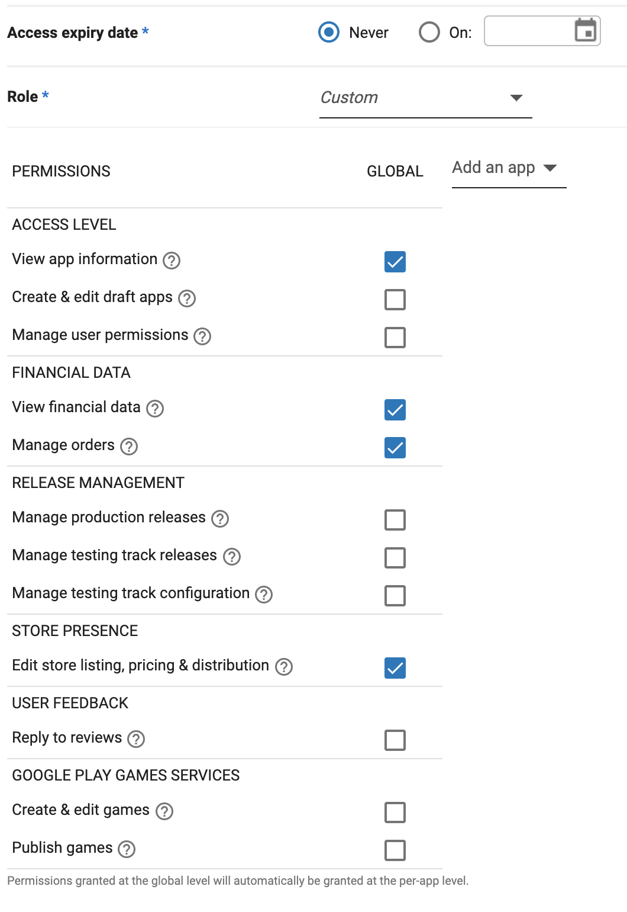

    12. Optional. It takes at least 24 hours for changes to take effect but there's a [hack](https://stackoverflow.com/a/60691844). In [Google Play Console](https://play.google.com/apps/publish/), open Your App Dashboard -&gt; **Store Presence** -&gt; **In-app Products**. Change the description of any product, click **Save**. Everything should be working now, you can revert in-app changes. If not, make sure **Google Play Android Developer API** is enabled in [Google Cloud Platform API Library](https://console.cloud.google.com/apis/library/androidpublisher.googleapis.com).

### Real-time developer notifications \(RTDN\)

Real-time developer notifications \(RTDN\) allow receiving updates the moment they occur in Play Store, tracking refunds, and more. We highly recommend setting them up.

To enable sending Google Play [RTDN](https://developer.android.com/google/play/billing/rtdn-reference) to Adapty, make sure that [Cloud Pub/Sub API is enabled](%20https://console.developers.google.com/apis/api/pubsub.googleapis.com/overview) and your [Service Account Key file](android-sdk.md#service-account-key-file) has Owner permissions**.** Upload the key to Adapty, as described [here](android-sdk.md#service-account-key-file).  
Adapty will automatically create all needed resources in your Google Cloud, and the topic name will appear in the **Google Play RTDN topic name** field on [Android SDK settings page](https://app.adapty.io/settings/android-sdk).

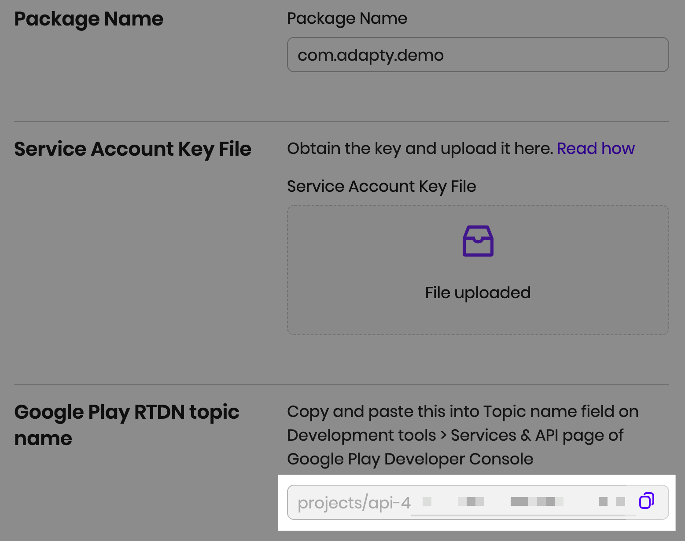

  
Copy and paste it's value into the **Topic name** field found at App Dashboard -&gt; **Monetization setup** page of Google Play  Console, click **Send test notification** to make sure everything works, and save the changes**.**

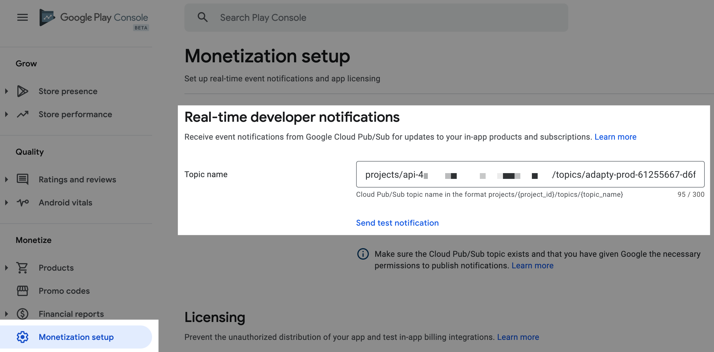

If you use Old \(Classic\) Google Play Console, set up RTDN at App Dashboard -&gt; **Development Tools** -&gt; **Services & APIs**.

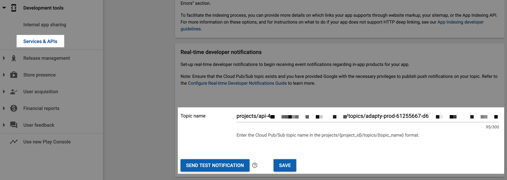

### Push Notifications

To send push notifications you have to enter Firebase Cloud Messaging \(FCM\) **server key** in Adapty dashboard. Open Firebase, choose the app you want to use, go to **Project Settings -&gt; Cloud Messaging**, and copy the server key. If you don't have one you can create it by clicking the Add server key button in the right top corner.

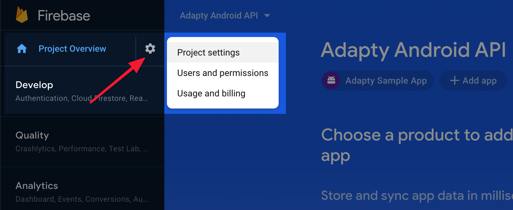

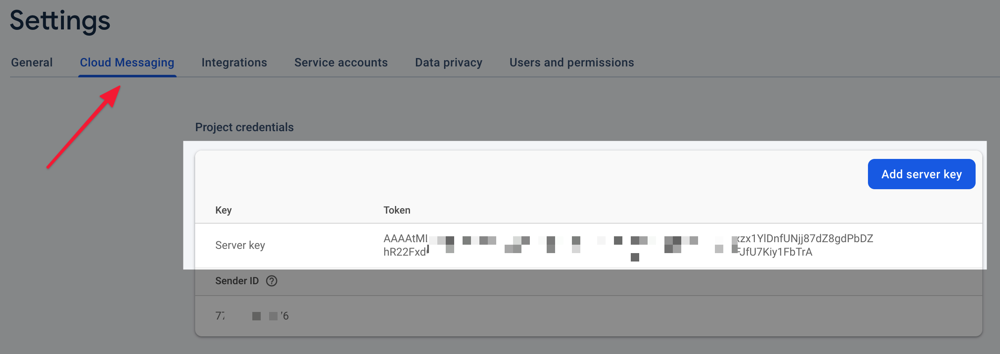

