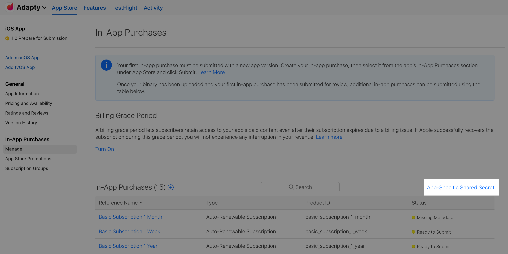
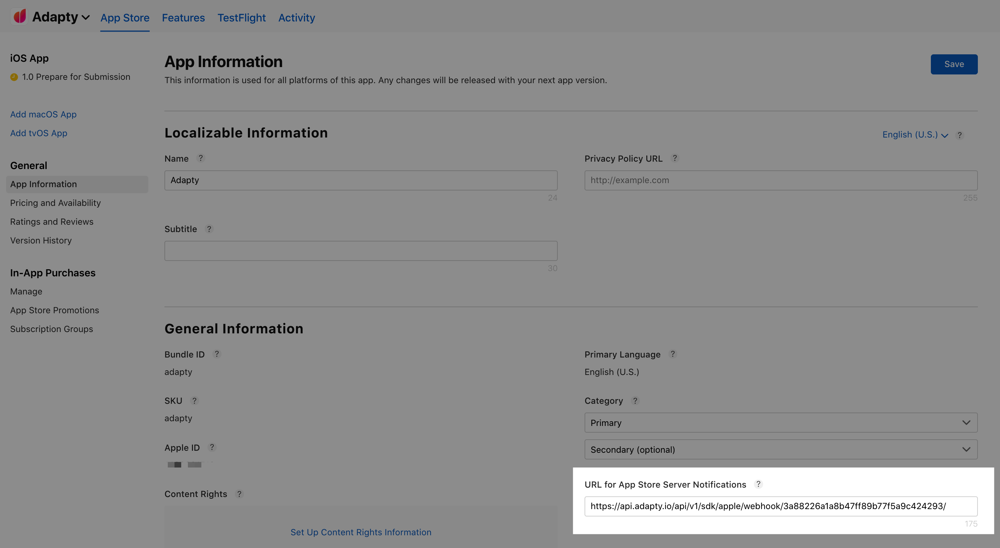

# iOS SDK

For [Adapty iOS SDK](https://github.com/adaptyteam/AdaptySDK-iOS) to work you need to enter a couple of keys.


| Field | Description |
| :--- | :--- |
| **Bundle ID** | Your app bundle ID |
| **App Store Connect shared secret** | A key for receipts' validation and preventing fraud in your app. Read below how to find it |
| **Subscription Key** | A key for using Subscription Offers. Read below how to find it |
| **App Store Connect subscription status URL** | URL that is used to enable [server2server notifications](https://developer.apple.com/documentation/storekit/in-app_purchase/subscriptions_and_offers/enabling_server-to-server_notifications) from the App Store to monitor and respond to users' subscription status changes |
| **Push notifications certificates** | To send Push notifications in [Promo campaigns](../profiles-and-promo-campaigns/promo-campaigns.md) Adapty certificate to sign them. Adapty support both dev and prod certificates |


### App Store Connect shared secret

Adapty uses this key for receipt verification. This key is app-specific, __make sure to generate it for each of your apps.


However, you can generate one Primary Shared Secret, and use one key for all your apps. To generate it, go to Users and Access -&gt; [Shared Secret](https://appstoreconnect.apple.com/access/shared-secret) page, and click **Generate** there.


Go to **Manage** page in section **In-App Purchases**. On the right, you can see **App-Specific Shared Secret** link, click it, and you'll be able to see or create a new shared secret.



Generate a Shared Secret, copy it, and don't forget to paste it in Adapty Dashboard.


### Subscription Key

The Subscription Key is used for [Promotional offers](https://developer.apple.com/documentation/storekit/in-app_purchase/subscriptions_and_offers/implementing_subscription_offers_in_your_app). For example, you can offer user upfront payment for 6 months with a 40% discount, and after that user will pay the regular subscription price every month. To generate a subscription key:

1. Log in into App Store Connect and open [Users and Access](https://appstoreconnect.apple.com/access/api).


   2. Generate a Subscription key \(you can name it Adapty\) and download it as a `.p8` file.

   3. Upload `.p8` file to Adapty and copy-paste KEY ID.


\*\*\*\*

### **App Store Connect subscription status URL**

Apple offers server-to-server notifications, so you can instantly be notified about subscription events.

Adapty helps you with that. The only thing you need to do is to set URL for App Store Server Notifications inside your App Store Connect to Adapty status URL.

1. Copy App Store Connect subscription status URL in Adapty App Settings



This URL is specific to each of your apps. So if you have multiple apps, you need to set different URLs


     2. Sign-in into your App Store Connect account, choose the app, and go to the **App Information** page in section **General**. Paste subscription status URL into URL for App Store Server Notifications, and save the changes. It may take up to 72 hours for the changes to take effect. 



\*\*\*\*

### **Push notifications**

With Adapty you can automate [promo campaigns](../profiles-and-promo-campaigns/promo-campaigns.md) in Push notifications. For that, Adapty needs a certificate to securely sign notifications. It takes several steps to generate and may take about 15 minutes.

#### Create a signing certificate

Open Keychain Access and on the upper menu choose _Keychain Access -&gt; Certificate Assistant -&gt; Request a Certificate From a Certificate Authority._


Enter your email and name and save the certificate to a disk. It'll be named like _CertificateSigningRequest.certSigningRequest._ 


Create a folder to save all files in one place. For example, name it _Adapty Push Certificates_



#### Create an Identity and Apple Certificate

Open [Apple Developer](https://developer.apple.com) and then [Certificates -&gt; Identifiers](https://developer.apple.com/account/resources/certificates/list).


Choose your identifier, activate Push Notifications and hit Save.



Do not configure/edit Push Notifications settings on the page above. It's a legacy stuff. The method below allows you create certificate much easier.


Go to Certificates section and start new certificate generation


Scroll down and select _Apple Push Notification service SSL \(Sandbox & Production\)_


Choose your Identifier and upload a certificated generated on your Mac earlier 


And download a certificate as _aps.cer_ file.

Open the _aps.cer_ file in the Keychain and export in as a p12 file.


Please be sure that you choose Certificate category! Otherwise you can't export it a p12 file. Yeap, that's super weird.

The last thing, convert your p12 file to a plain text. Open terminal and enter a command

```text
openssl pkcs12 -in cert.p12 -nodes > open_cert.p12
```

change _cert.p12_ to your file name.

And the last, upload a certificate to Adapty.


## 

